# Manual Técnico — Proyecto Final Fase 1 y Fase 2
## Infraestructura de Red Empresarial: AD DS, DNS, DHCP, File Server, Correo, Web IIS y FTP

> **Carátula**
>
> **Universidad de San Carlos de Guatemala — Escuela de Ciencias y Sistemas**  
> **Asignatura:** Prácticas Iniciales "C"
> **Proyecto Final — Fase 1 (24/09/2026):** Numerales 1.1, 1.2, 1.3 y 1.4  
> **Proyecto Final — Fase 2 (15/10/2026):** Numerales 1.5, 1.6 y 1.7  
> **Grupo:** 7  
> **Estudiantes:**
> - Josué Javier Carrera Soyós
> - Alvaro Javier Paredes Sulá
>
> **Dominio del laboratorio:** `servidor1.com`  
> **Servidor:** Windows Server 2022 (WS22) — IP `192.168.0.20`  
> **Clientes:** Windows 10 y Ubuntu Desktop 24.04 LTS

---

## Índice

- [Introducción](#introducción)
- [Resumen técnico del laboratorio](#resumen-técnico-del-laboratorio)
- [1.1 Servicio de Virtualización](#11-servicio-de-virtualización)
- [1.2 Servidor de Identidad y Autenticación (Active Directory)](#12-servidor-de-identidad-y-autenticación-active-directory)
  - [1.2.1 Servicio DNS](#121-servicio-dns-instalación-y-verificación)
  - [1.2.2 Servicio Active Directory Domain Services (AD DS)](#122-servicio-active-directory-domain-services-ad-ds)
  - [1.2.3 Cuentas de usuario del dominio](#123-cuentas-de-usuario-del-dominio)
  - [1.2.4 Unión de clientes al dominio](#124-unión-de-clientes-al-dominio-windows-y-linux)
  - [1.2.5 Validación de autenticación](#125-validación-de-autenticación)
  - [1.2.6 GPO — Fondo de pantalla corporativo](#126-gpo--fondo-de-pantalla-corporativo-obligatorio)
  - [1.2.7 GPO organizacional — Navegador (Edge / Chrome)](#127-gpo-organizacional--navegador-microsoft-edge--google-chrome)
- [1.3 Servidor de Asignación Dinámica de IP (DHCP)](#13-servidor-de-asignación-dinámica-de-ip-dhcp)
- [1.4 Servidor de Archivos y Recursos Compartidos (File Server)](#14-servidor-de-archivos-y-recursos-compartidos-file-server)
- [1.5 Servidor de Correo Electrónico](#15-servidor-de-correo-electrónico)
  - [1.5.1 Registros DNS para correo (MX y A)](#151-registros-dns-para-correo-mx-y-a)
  - [1.5.2 Cuentas de correo en Active Directory](#152-cuentas-de-correo-en-active-directory)
  - [1.5.3 Instalación y configuración de hMailServer](#153-instalación-y-configuración-de-hmailserver)
  - [1.5.4 Cliente Thunderbird en Ubuntu](#154-cliente-mozilla-thunderbird-en-ubuntu-linux)
  - [1.5.5 Prueba de envío y recepción](#155-prueba-de-envío-y-recepción)
- [1.6 Servidor Web (IIS 10.0)](#16-servidor-web-internet-information-services--iis-100)
  - [1.6.1 Instalación del rol Web Server](#161-instalación-del-rol-web-server-iis)
  - [1.6.2 Sitios publicweb y privadaweb](#162-sitios-publicweb-y-privadaweb)
  - [1.6.3 Redirección de correo](#163-redirección-de-correo-correo)
  - [1.6.4 Verificación de sitios](#164-verificación-de-sitios)
- [1.7 Servidor FTP](#17-servidor-ftp)
  - [1.7.1 Instalación del servicio FTP de IIS](#171-instalación-del-servicio-ftp-de-iis)
  - [1.7.2 Sitio FTP_Publico](#172-sitio-ftp_publico)
  - [1.7.3 Verificación de transferencia](#173-verificación-de-transferencia)
- [Conclusiones de Fase 1 y Fase 2](#conclusiones-de-fase-1-y-fase-2)
- [Anexo A — Tabla resumen de direccionamiento y cuentas](#anexo-a--tabla-resumen-de-direccionamiento-y-cuentas)
- [Anexo B — Comandos de referencia rápida](#anexo-b--comandos-de-referencia-rápida)
- [Anexo C — Referencias y documentación oficial](#anexo-c--referencias-y-documentación-oficial)

---

## Introducción

En toda organización moderna, los servicios de red constituyen la base sobre la que operan los usuarios, los equipos y las aplicaciones. La gestión centralizada de identidades, la resolución de nombres, la asignación ordenada de direcciones IP y el control de acceso a la información son requisitos mínimos para garantizar seguridad, trazabilidad y continuidad operativa. Este manual nace con el propósito de documentar cómo se construye dicha base, paso a paso y con evidencia verificable, utilizando herramientas empresariales reales en un entorno de laboratorio virtualizado.

El proyecto se desarrolla sobre dos computadoras físicas (hosts) con Oracle VirtualBox, donde se virtualizan un servidor Windows Server 2022 y clientes Windows 10 y Ubuntu Desktop 24.04 LTS, todos integrados al dominio `servidor1.com`. A lo largo del documento se explica no solo *cómo* se configuró cada servicio, sino *para qué sirve*, *qué requisitos exige* y *cómo se comprueba que funciona*, manteniendo un lenguaje técnico y profesional pero de fácil comprensión para estudiantes y evaluadores.

### Objetivo general

Diseñar, configurar e integrar una infraestructura de red empresarial funcional en un entorno virtualizado, que provea identificación centralizada, resolución de nombres, direccionamiento dinámico, recursos compartidos controlados por permisos, comunicación por correo electrónico, publicación web y transferencia de archivos.

### Objetivos específicos de la Fase 1 y la Fase 2

1. Virtualizar el servidor y los clientes con conectividad en modo puente dentro del mismo segmento de red.
2. Implementar DNS y Active Directory Domain Services (AD DS) para autenticación centralizada del dominio `servidor1.com`.
3. Automatizar el direccionamiento IPv4 mediante DHCP, con exclusiones, concesiones y reservas por MAC.
4. Centralizar archivos con SMB/CIFS aplicando permisos compartidos y NTFS diferenciados (recurso público y privado).
5. Estandarizar la experiencia de usuario mediante directivas de grupo (GPO) de fondo de pantalla y navegador.
6. Desplegar correo electrónico interno (SMTP/IMAP/POP3) con autenticación contra Active Directory y cliente Thunderbird en Linux.
7. Publicar sitios web en IIS 10.0 (público, privado con autenticación en puerto 1080 y redirección de correo por HTTP Redirect).
8. Habilitar transferencia de archivos por FTP de IIS con autenticación de dominio y permisos de lectura y escritura sobre la Carpeta Pública.

Este manual documenta el proyecto completo, correspondiente a los numerales **1.1 a 1.7** de las especificaciones:

1. **1.1** Virtualización
2. **1.2** Identidad y autenticación (AD DS + DNS + GPO)
3. **1.3** Asignación dinámica de IP (DHCP)
4. **1.4** Archivos y recursos compartidos (File Server SMB/CIFS)
5. **1.5** Correo electrónico (SMTP/IMAP/POP3 con hMailServer + Thunderbird)
6. **1.6** Servidor web (IIS 10.0: publicweb, privadaweb, correo)
7. **1.7** Servidor FTP (IIS FTP sobre la Carpeta Pública)
### Enfoque del documento

Cada sección sigue la misma estructura exigida en los entregables:

1. **¿Para qué sirve?** — propósito técnico del servicio.
2. **Requisitos previos.**
3. **¿Cómo se configura?** — procedimiento paso a paso tal como se ejecutó en el laboratorio.
4. **¿Cómo se verifica?** — evidencia con capturas.
5. **Notas técnicas** — comportamiento observado, limitaciones y buenas prácticas.

Explicaciones accesibles para un lector con conocimientos básicos de redes y sistemas operativos.

---

## Resumen técnico del laboratorio

| Elemento | Valor configurado |
|---|---|
| Dominio AD / DNS | `servidor1.com` |
| Controlador de dominio | `WS22` — Windows Server 2022, IP estática `192.168.0.20/24` |
| Hipervisor | Oracle VirtualBox, red en modo **Bridged Adapter** |
| Cliente Windows | Windows 10, IP reservada DHCP `192.168.0.51` |
| Cliente Linux | Ubuntu Desktop 24.04 LTS, IP reservada DHCP `192.168.0.50`, unido al dominio con `realmd/sssd` |
| Rango DHCP | `192.168.0.1` a `192.168.0.100`, máscara `255.255.255.0 (/24)` |
| Exclusiones DHCP | `192.168.0.1` (gateway/router) y `192.168.0.20` (servidor-dominio) |
| Lease time | 8 días (valor predeterminado de Windows Server) |
| Usuarios del dominio | `usuario1@servidor1.com` / `usuario2@servidor1.com`, contraseña `Password1` |
| Recurso público | `\\192.168.0.20\Publica` — acceso total para usuarios autenticados (`Everyone`) |
| Recurso privado | `\\192.168.0.20\Privada` — acceso restringido (en laboratorio: `usuario1`; ver nota sobre especificación `privado/privado`) |
| GPO 1 | Fondo de escritorio corporativo obligatorio (logo USAC) |
| GPO 2 | Página de inicio institucional en Microsoft Edge / Google Chrome vía plantillas ADMX / políticas JSON |
| Correo (hMailServer) | Dominio `servidor1.com`, `mail.servidor1.com → 192.168.0.20`, MX + A, SMTP 25 / IMAP 143 / POP3 110, cuentas `correo1@servidor1.com` y `correo2@servidor1.com` con autenticación AD, cliente Thunderbird en Ubuntu |
| Web (IIS 10.0) | `http://192.168.0.20/publicweb` (público), `http://192.168.0.20:1080/privadaweb` (restringido, autenticación Basic/Windows), `http://192.168.0.20/correo` (HTTP Redirect al webmail) |
| FTP (IIS) | Sitio `FTP_Publico` en puerto 21 sobre la Carpeta Pública, autenticación Basic de dominio (`usuario1`, `usuario2`), lectura y escritura |

---

## 1.1 Servicio de Virtualización

### 1.1.1 ¿Para qué sirve?

La virtualización permite ejecutar múltiples máquinas virtuales (VM) aisladas sobre un mismo hardware físico (*host*), mediante un hipervisor. En este proyecto se utiliza para simular una red empresarial completa sin requerir servidores físicos dedicados:

- **1 Servidor Virtual:** Windows Server 2022 (controlador de dominio, DNS, DHCP, archivos).
- **1 Cliente Virtual:** Ubuntu Desktop 24.04 LTS o Windows 10/11.
### 1.1.2 Implementación en este proyecto

Se optó por **Oracle VirtualBox** como hipervisor, por su disponibilidad, soporte de red en puente y compatibilidad con Windows Server y Linux.

Inventario de VM en el host (ver Figura 1):

- `WS22` — Windows Server 2022.
- `W10` — Windows 10 (cliente de dominio y validación de GPO).
- `Ubuntu24` — Ubuntu 24.04 LTS (cliente Linux unido a AD).

**Figura 1 — Ventana principal de VirtualBox con las máquinas virtuales del laboratorio.**

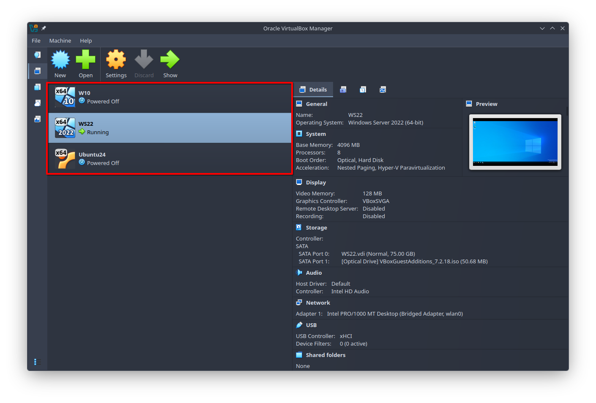
### 1.1.3 Configuración de red: Bridged Adapter

Para la comunicación se configuró la red en modo **Bridge Adapter (adaptador puente)**.

**¿Qué es?**

- En modo puente, la VM se conecta directamente a la red física del host como si fuera un equipo independiente. Obtiene su propia dirección IP del mismo segmento (en este caso `192.168.0.0/24`) y es visible para el router, el servidor y las demás VM.
- Diferencia con NAT: en NAT la VM queda oculta tras el host y no es accesible desde la LAN; en red interna o *host-only* no sale a la red física. El modo puente es el adecuado cuando se requiere que el servidor sea alcanzable por nombre DNS (`servidor1.com`) desde todos los clientes.

**Referencia:** [VirtualBox — Bridged networking](https://www.virtualbox.org/manual/ch06.html#network_bridged)

---

## 1.2 Servidor de Identidad y Autenticación (Active Directory)

> **Objetivo de la sección:** Implementar Active Directory Domain Services (AD DS) en Windows Server 2022 para la gestión centralizada de usuarios en el dominio `servidor1.com`, con DNS integrado, cuentas de dominio y directivas de grupo (GPO).

### 1.2.1 Servicio DNS — Instalación y verificación

**¿Para qué sirve?**

El Sistema de Nombres de Dominio (DNS) traduce nombres legibles (`servidor1.com`) a direcciones IP (`192.168.0.20`). Sin DNS, los clientes no podrían localizar el controlador de dominio, unirse al dominio ni resolver recursos SMB (`\\servidor1.com\Publica`). En este diseño, el propio controlador de dominio es el **servidor DNS principal** del laboratorio.

**Requisito previo:** IP estática en el servidor (`192.168.0.20`, máscara `255.255.255.0`, DNS preferido `127.0.0.1` o su propia IP).

**Procedimiento ejecutado:**

1. Abrir **Server Manager > Dashboard > (2) Add roles and features**. Esta opción inicia el asistente para agregar roles y características al servidor.

**Figura 2 — Server Manager. La opción “2 Add roles and features” permite agregar AD DS, DNS y DHCP.**

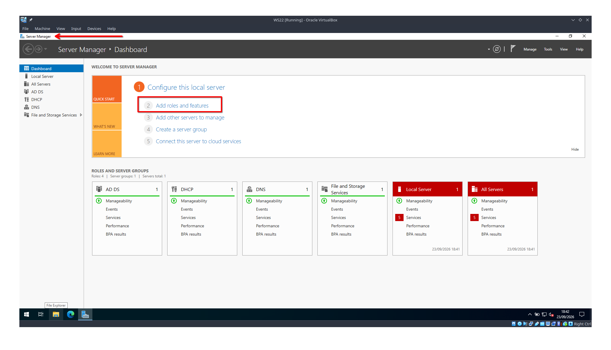

2. En *Server Roles* seleccionar **Active Directory Domain Services**, **DNS Server** y **DHCP Server** (DHCP se utilizará en la sección 1.3, pero se instala en el mismo paso para optimizar).

3. Completar el asistente con los valores predeterminados hasta finalizar la instalación. El proceso es guiado; basta conocer qué roles requiere cada servicio.

4. Verificar en el Dashboard que los roles aparecen como instalados y operativos (barra verde de *Manageability*).

**Figura 3 — Roles AD DS, DHCP y DNS instalados y activos.**

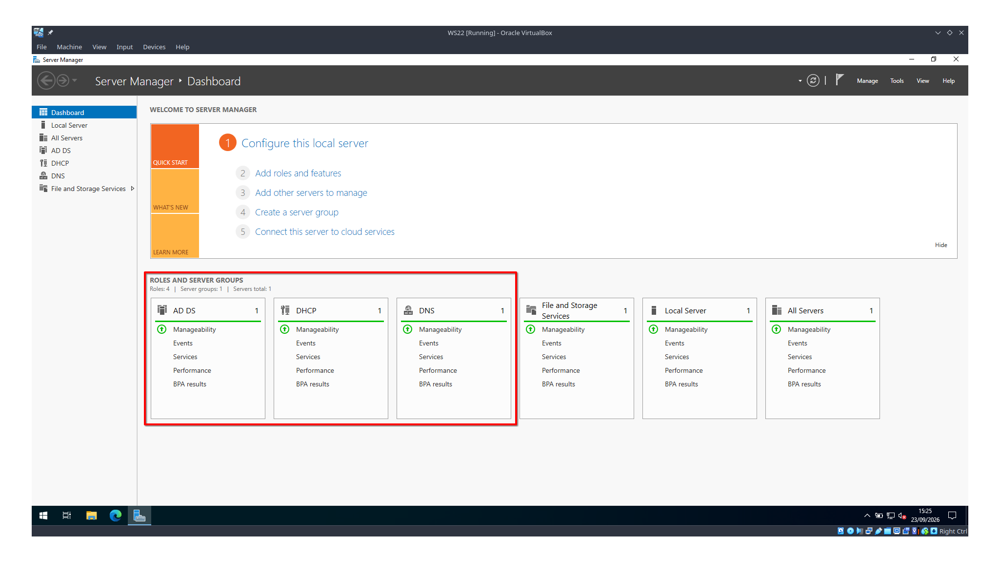

**Alternativa por PowerShell (equivalente, útil para auditoría y Fase 2):**

```powershell
# Instalación de roles AD DS y DNS con herramientas de administración
Install-WindowsFeature -Name AD-Domain-Services, DNS -IncludeManagementTools

# Promoción del servidor como nuevo bosque (crea el dominio servidor1.com con DNS integrado)
Install-ADDSForest -DomainName "servidor1.com" -InstallDns:$true
```

Después de la promoción el servidor se reinicia y queda como controlador de dominio del bosque raíz `servidor1.com`.

**Verificación DNS:**

Desde el cliente Linux se ejecutó `ping` hacia el nombre de dominio para comprobar resolución y conectividad:

```bash
ping servidor1.com
```

Una respuesta sin pérdida de paquetes confirma que el nombre resuelve a `192.168.0.20` y que existe conectividad de nivel 3.

**Figura 4 — Ping a `servidor1.com` desde Linux. Responde con la IP `192.168.0.20` asignada al servidor.**


> **Nota:** Toda prueba y navegación del proyecto debe realizarse a través del dominio `servidor1.com` (resolución DNS), no mediante IP directa, según las restricciones técnicas del enunciado).

**Referencias:**
- [AD DS Overview — Microsoft Learn](https://learn.microsoft.com/en-us/windows-server/identity/ad-ds/get-started/virtual-dc/active-directory-domain-services-overview)
- [DNS Overview — Microsoft Learn](https://learn.microsoft.com/en-us/windows-server/networking/dns/dns-top)

### 1.2.2 Servicio Active Directory Domain Services (AD DS)

**¿Para qué sirve?**

AD DS es el servicio de directorio de Microsoft. Centraliza la autenticación (quién puede entrar), la autorización (a qué puede acceder) y la aplicación de directivas (qué configuración recibe). Sin AD, cada equipo tendría cuentas locales aisladas; con AD, `usuario1@servidor1.com` es válido en todos los equipos unidos al dominio.

**Configuración del dominio:**

1. Tras instalar el rol AD DS, hacer clic en la notificación (bandera amarilla) **“Promote this server to a domain controller”**.
2. Elegir **Add a new forest > Root domain name: `servidor1.com`**.
3. Definir contraseña de restauración DSRM, aceptar valores de NetBIOS (`SERVIDOR1`), rutas NTDS/SYSVOL y revisar prerrequisitos.
4. Instalar y reiniciar. Al iniciar sesión, el dominio será `SERVIDOR1`.

Para administración diaria se utiliza la consola **Active Directory Users and Computers (`dsa.msc`)**, donde se crean Unidades Organizativas (OU), usuarios y grupos.

> **Buena práctica aplicada:** se creó una **Unidad Organizativa (OU)** dedicada para aplicar las GPO solo a los usuarios del laboratorio, evitando afectar a `Domain Controllers` o cuentas administrativas. Las GPO se enlazan a la OU, no al dominio completo.

### 1.2.3 Cuentas de usuario del dominio

| Usuario | UPN (Principal Name) | Contraseña |
|---|---|---|
| usuario1 | usuario1@servidor1.com | Password1 |
| usuario2 | usuario2@servidor1.com | Password1 |

> **Nota:** La especificación original indica `Password`, pero se utilizó `Password1` (agregando el `1`) por limitaciones de la política de contraseñas del servidor, que exige complejidad mínima (mayúsculas, minúsculas y dígito).

**Procedimiento (`dsa.msc > OU > New > User`):**

1. Crear `usuario1` vinculado al dominio. Las siguientes figuras, tomadas de la actividad de verificación del 17/08/2026, muestran el alta y la asignación de contraseña.

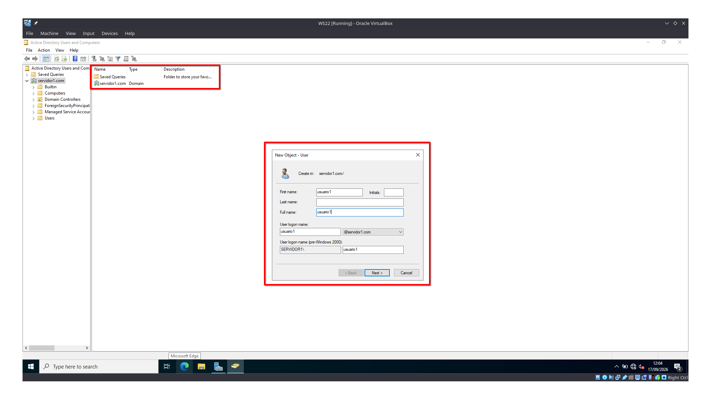

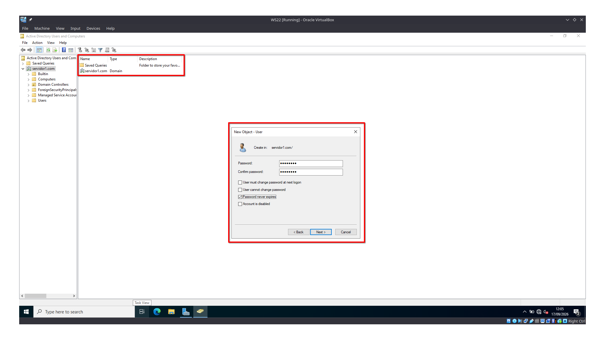

2. Repetir para `usuario2`. La consola muestra ambos usuarios ya creados y habilitados.

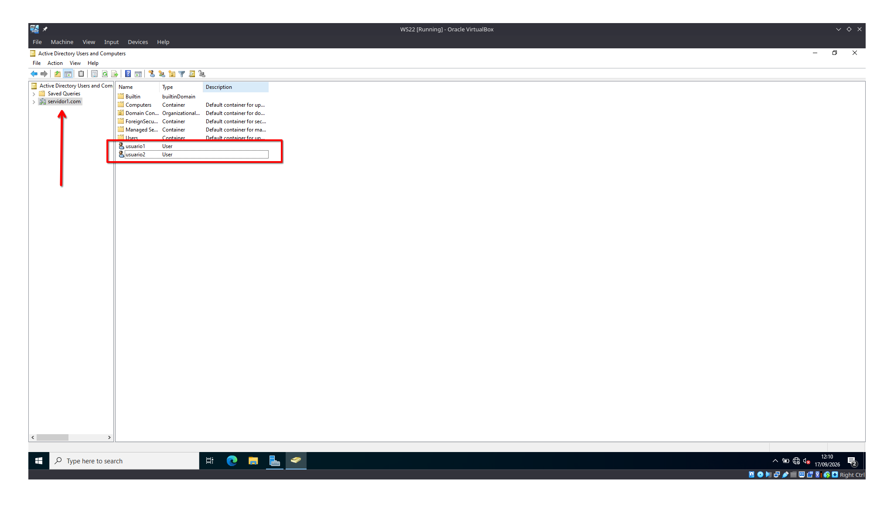

> Las cuentas quedan habilitadas para iniciar sesión en cualquier equipo unido al dominio. 

### 1.2.4 Unión de clientes al dominio (Windows y Linux)

#### Cliente Windows 10

1. En el cliente, configurar como DNS preferido la IP del servidor (`192.168.0.20`).
2. `System > About > Join a domain` o por PowerShell (ejecutado como administrador):

```powershell
Add-Computer -DomainName "servidor1.com" -Credential (Get-Credential) -Restart
```

3. Reiniciar. En la pantalla de inicio de sesión usar **Other user** e ingresar `usuario1@servidor1.com` / `Password1`. El texto `Sign in to: SERVIDOR1` confirma que autentica contra el dominio y no contra una cuenta local.

Para distinguir una cuenta local de una de dominio, en Windows puede usarse `.\usuario_local` (cuenta local) frente a `servidor1\usuario1` o `usuario1@servidor1.com` (cuenta de dominio).

```powershell
# Ver usuarios locales del equipo (no son del dominio)
Get-LocalUser
```

#### Cliente Linux — Ubuntu 24.04 LTS unido a AD con realmd/sssd

**¿Para qué sirve?** Permite que los usuarios de AD inicien sesión en Ubuntu con las mismas credenciales, cumpliendo la restricción de contar con un cliente Linux unido al dominio que demuestre al menos 2 funcionalidades (en este laboratorio: resolución DNS + autenticación AD + acceso SMB + políticas de Chrome).

**Procedimiento ejecutado:**

```bash
# 1. Instalar paquetes de integración
sudo apt update && sudo apt install -y realmd sssd sssd-tools adcli krb5-user

# 2. Descubrir el dominio en la red (debe resolver vía DNS a 192.168.0.20)
realm discover servidor1.com

# 3. Unirse al dominio (solicita credencial de Administrador del dominio)
sudo realm join -U 'Administrador' servidor1.com

# 4. Habilitar creación automática de /home al primer inicio de sesión
sudo pam-auth-update --enable mkhomedir

# 5. Reiniciar el servicio de identidades
sudo systemctl restart sssd
```

El paso 4 corresponde a la Figura 5. Sin este ajuste, el inicio de sesión de un usuario de dominio en Linux falla o queda sin directorio personal.

**Figura 5 — Configuración PAM en Ubuntu. La opción “Create home directory on login” indica a Linux que debe crear automáticamente los directorios `/home/usuario` en el primer inicio de sesión.**


**Referencias:**
- [Ubuntu — Join Active Directory (realmd/sssd)](https://ubuntu.com/server/docs/service-sssd-ad)
- [SSSD Documentation](https://sssd.io/docs/introduction.html)

### 1.2.5 Validación de autenticación

Se realizaron tres niveles de validación (evidencia de la actividad del 17/08/2026):

**a) Validación local en el servidor (`runas`):**

```cmd
runas /user:usuario1@servidor1.com cmd.exe
```

Al ingresar la contraseña se abrió una consola con título `cmd.exe (running as usuario1@servidor1.com)`, lo que confirma que las credenciales son válidas y que la cuenta puede iniciar procesos.

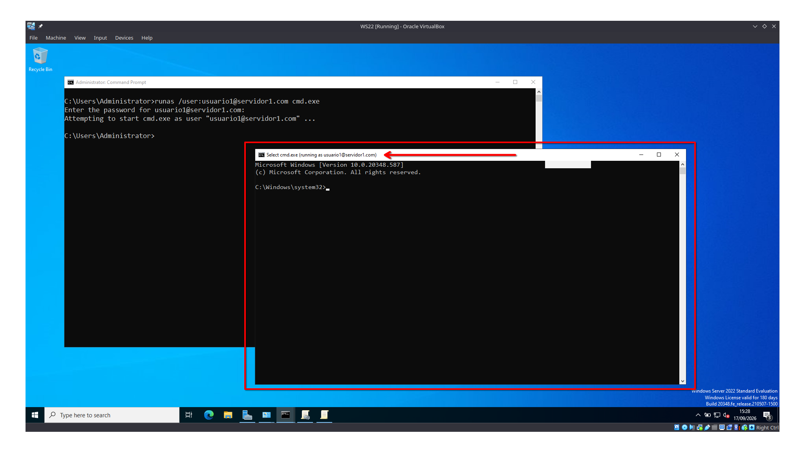

**b) Inicio de sesión en cliente Windows 10:**

Selección de `Other user`, ingreso de credenciales de `usuario1`, indicador `Sign in to: SERVIDOR1`. El escritorio cargó sin errores con el perfil del dominio.

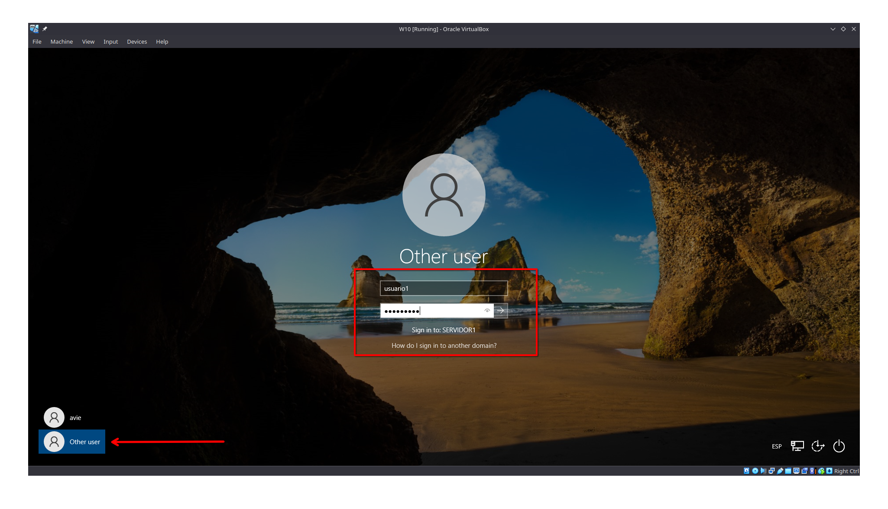

**c) Verificación de identidad efectiva (`whoami`):**

```cmd
whoami
:: resultado esperado:
:: servidor1\usuario1
```

Esto demuestra que la sesión activa corresponde al usuario del dominio y no a un usuario local, validando de extremo a extremo la creación de usuarios, la unión al dominio y la autenticación.

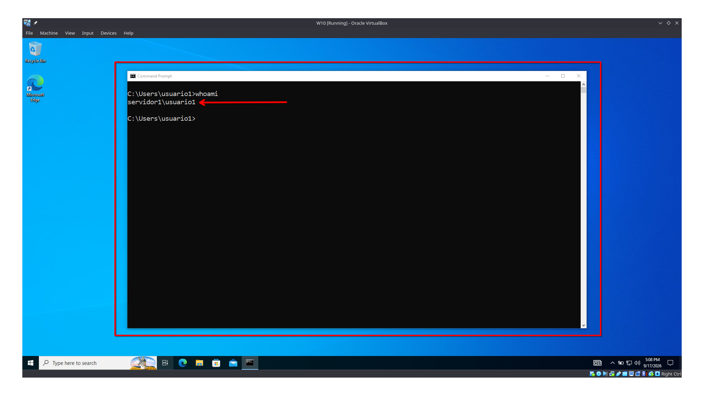

### 1.2.6 GPO — Fondo de pantalla corporativo obligatorio

**¿Para qué sirve?** Las Directivas de Grupo (GPO, *Group Policy Objects*) permiten aplicar configuración centralizada a usuarios y equipos. En este caso se impone el logotipo de la Universidad como fondo de escritorio al iniciar sesión, sin que el usuario pueda cambiarlo permanentemente.

**Diseño:** GPO enlazada a la OU de usuarios del laboratorio (ver §1.2.2).

**Procedimiento (`gpmc.msc`):**

1. Crear GPO (ej. `GPO_FondoPantalla`) y enlazarla a la OU.
2. Editar: `User Configuration > Policies > Administrative Templates > Desktop > Desktop > Desktop Wallpaper`.
3. Habilitar (*Enabled*), indicar ruta UNC del fondo (ej. `\\servidor1.com\Publica\FondoUsac.jpg`) y estilo (Fill/Centered).
4. Cerrar sesión y volver a iniciarla en el cliente para aplicarla.

**Figura 6 — OU creada para aplicar las GPO a un grupo de usuarios.**


**Figura 7 — Configuración del fondo en `User Policies > Templates > Desktop > Desktop Wallpaper`.**


**Figura 8 — Verificación en cliente Windows 10: fondo institucional aplicado tras inicio de sesión con usuario de dominio.**


### 1.2.7 GPO organizacional — Navegador (Microsoft Edge / Google Chrome)

**¿Para qué sirve?** Estandarizar el navegador corporativo: establecer la página de inicio institucional, definir comportamiento al abrir el navegador y, opcionalmente, bloquear extensiones no autorizadas o restringir almacenamiento masivo USB. Es la “GPO organizacional” exigida en el enunciado.

**¿Qué son las plantillas ADMX?** Son archivos de definición de directivas (`*.admx` + `*.adml` de idioma) que extienden el Editor de directivas con opciones específicas de un producto (Edge, Chrome). Sin importarlas, esas opciones no aparecen en `gpedit/gpmc`.

**Descarga e instalación (Edge):**

1. Descargar **Microsoft Edge Policy Files** (versión correspondiente al Edge instalado) desde [Microsoft Edge Enterprise — Download policy files](https://www.microsoft.com/en-us/edge/business/download).
2. Copiar `windows/admx/*.admx` a `C:\Windows\PolicyDefinitions\` y `windows/admx/es-ES/*.adml` (o `en-US`) a `C:\Windows\PolicyDefinitions\es-ES\`.
3. Abrir `gpmc.msc`. Aparecerá `User/Computer Configuration > Policies > Administrative Templates > Microsoft Edge > Startup, home page and new tab page`.

**Configuración aplicada en laboratorio:**

- `Action to take on startup` → **Open a list of URLs**.
- `Sites to open when the browser starts` → URL institucional (sitio de la Universidad).

**Figura 9 — Tras instalar las plantillas de Edge: `User Configuration > Startup, home page and new tab page`.**


**Figura 10 — `Action to take on startup`: indicar que debe abrir una lista de vínculos.**


> A continuación se configuró `Sites to open when the browser starts`, agregando el enlace institucional. Al abrir Edge, el navegador redirige en primer lugar al sitio de la institución.

**Figura 11 — Comprobación: al abrir el navegador dirige al sitio institucional.**


**Figura 12 — Verificación en `edge://policy`: aparecen aplicadas las directivas configuradas.**


**Cliente Linux — Google Chrome:**

No existe compatibilidad directa de GPO de Windows Server con Linux. En Ubuntu, Chrome se gestiona mediante **políticas JSON administradas**:

- Ruta: `/etc/opt/chrome/policies/managed/institucional.json`
- Ejemplo:

```json
{
  "HomepageLocation": "https://www.institucion.edu.gt",
  "RestoreOnStartup": 4,
  "RestoreOnStartupURLs": ["https://www.institucion.edu.gt"]
}
```

**Figura 13 — Chrome en cliente Linux con página institucional.**


**Figura 14 — Verificación en `chrome://policy`: políticas aplicadas.**


> **Nota de compatibilidad:** El fondo de pantalla no pudo implementarse en Linux por falta de equivalencia nativa de GPO. Windows 10 sí aplica ambas GPO de forma nativa sin problemas de compatibilidad.

> **Nota operativa:** En Windows 10 las GPO no siempre se aplican instantáneamente. Para forzar la actualización ejecutar como administrador y luego cerrar e iniciar sesión nuevamente.

**Figura 15 — `gpupdate /force` para forzar la aplicación de directivas.**


**Referencias:**
- [Configure Microsoft Edge policy settings — Microsoft Learn](https://learn.microsoft.com/en-us/deployedge/configure-microsoft-edge)
- [Chrome Enterprise Policy List](https://chromeenterprise.google/policies/)
- [Group Policy Overview — Microsoft Learn](https://learn.microsoft.com/en-us/windows-server/identity/ad-ds/plan/group-policy/group-policy-overview)

---

## 1.3 Servidor de Asignación Dinámica de IP (DHCP)

### 1.3.1 ¿Para qué sirve?

El Protocolo de Configuración Dinámica de Host (DHCP) asigna automáticamente direcciones IP, máscara, puerta de enlace y servidores DNS a los clientes. Evita conflictos por configuración manual y centraliza el control del direccionamiento.

- **Rango:** `192.168.0.1` a `192.168.0.100`.
- **Exclusiones, tiempo de concesión (*lease time*) y opciones DHCP (DNS Server y Gateway).**
### 1.3.2 Instalación del rol

Se reutiliza el rol DHCP instalado. Una vez instalado, se accede desde **Server Manager > Tools > DHCP** (consola `dhcpmgmt.msc`).

**Figura 16 — Acceso a la consola DHCP desde `Tools`.**

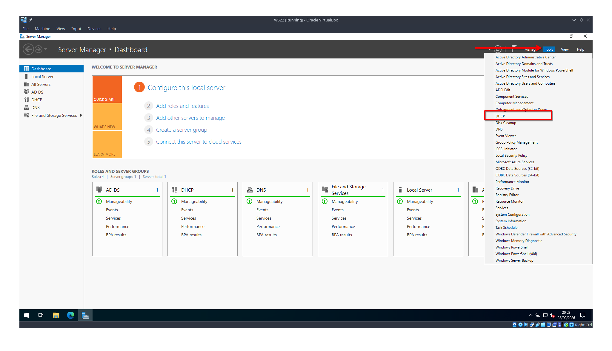

### 1.3.3 Creación del ámbito (Scope)

1. Desplegar el servidor, clic derecho sobre **IPv4 > New Scope** para iniciar el asistente.

**Figura 17 — Selección de `New Scope`.**

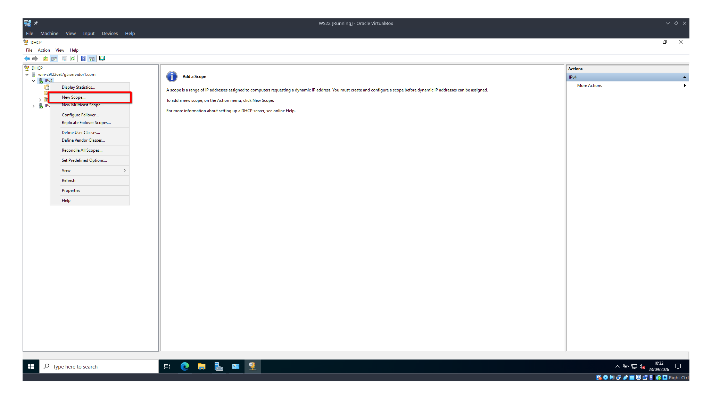

2. Asignar nombre descriptivo. En este laboratorio: **`Ambito_Red_Local`**.

**Figura 18 — Nombre del ámbito: `Ambito_Red_Local`.**

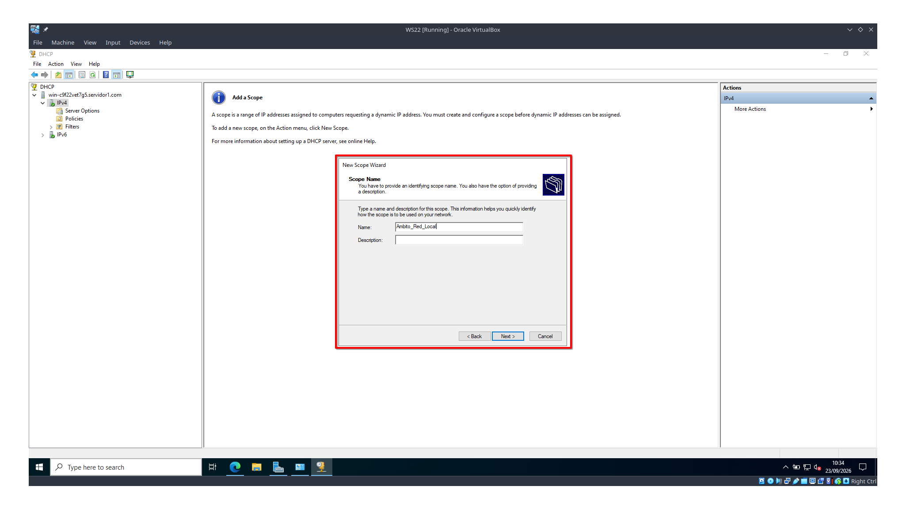

3. Definir el rango `192.168.0.1` – `192.168.0.100`, longitud `24`, máscara `255.255.255.0`.

**Figura 19 — Rango de IP del ámbito.**

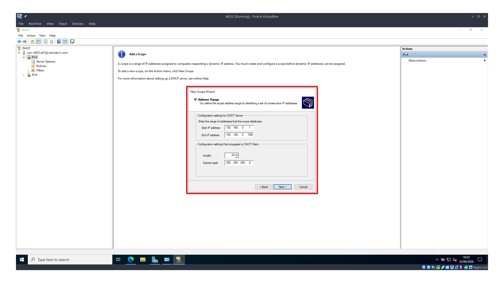

4. Agregar **exclusiones**: direcciones que DHCP nunca debe entregar porque ya están asignadas estáticamente. Se excluyó `192.168.0.1` (router/gateway) y `192.168.0.20` (servidor-dominio). El asistente permite excluir un rango o direcciones individuales.

**Figura 20 — Exclusiones: `.1` (router) y `.20` (servidor).**

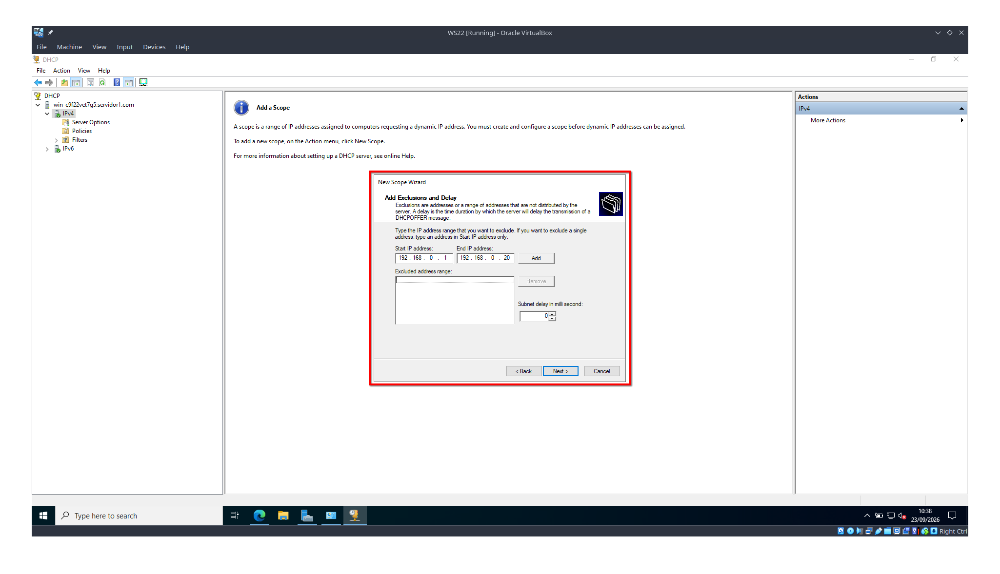

5. Configurar **Lease Duration** (duración de la concesión: tiempo durante el cual el cliente conserva la IP). Se mantuvo el valor predeterminado de **8 días**, adecuado para una red estable con equipos fijos.

**Figura 21 — Duración de concesión (8 días).**

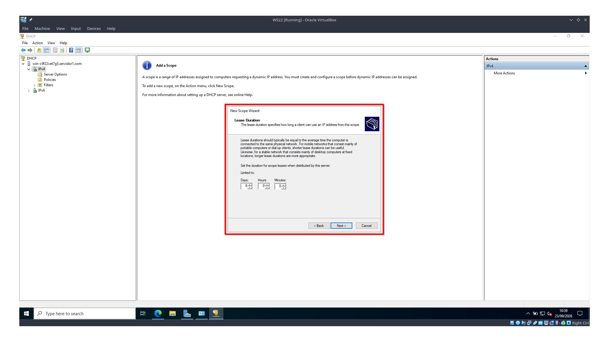

6. Configurar opciones DHCP. Cuando el asistente pregunta por el **DNS**, indicar la IP del servidor.

**Figura 22 — Configuración de DNS en el asistente.**

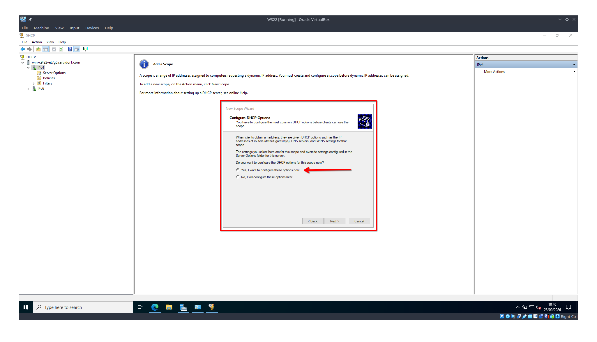

7. Agregar datos del dominio: nombre `servidor1.com` y dirección `192.168.0.20`. También debe configurarse la opción **003 Router (Gateway)** con la IP del router (`192.168.0.1`).

**Figura 23 — Dominio `servidor1.com` con IP `192.168.0.20`.**

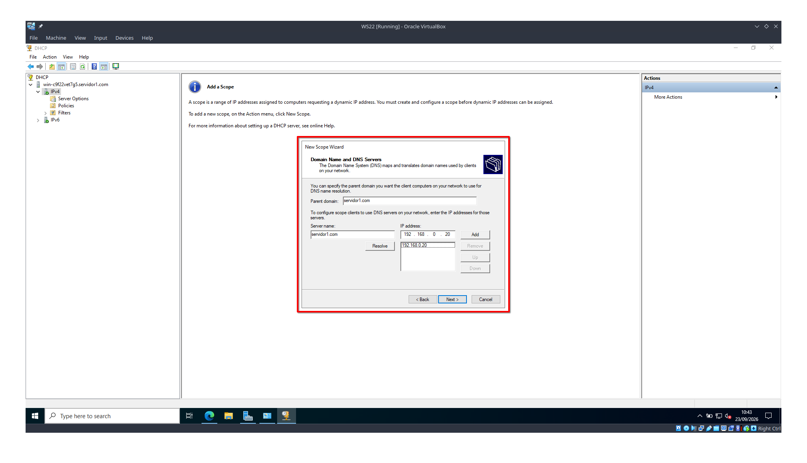

8. Finalizar y **activar** el ámbito. A partir de este momento el servidor puede arrendar direcciones.

**Figura 24 — Ámbito creado y finalizado. Desde aquí pueden crearse reservas.**

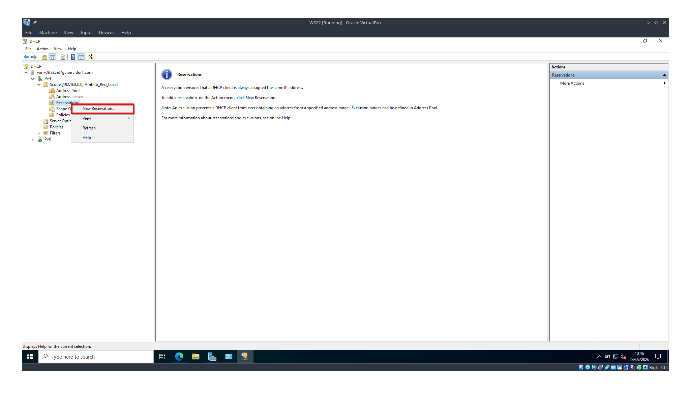

### 1.3.4 Reservas por dirección MAC

Para garantizar que equipos críticos reciban siempre la misma IP (comportamiento tipo estático pero gestionado por DHCP), se crean **reservas** vinculadas a la dirección MAC.

Asignación del laboratorio (dentro del rango permitido):

- Cliente Linux → `192.168.0.50`
- Cliente Windows → `192.168.0.51`

**¿Qué es una dirección MAC?** Es el identificador físico único de 48 bits de cada tarjeta de red (ej. `08:00:27:xx:xx:xx` en VirtualBox). DHCP la utiliza para reconocer al cliente y entregarle la IP reservada.

**¿Cómo obtenerla?**

- **Ubuntu 24.04:**

```bash
ip link show
# o
ip a
# la MAC aparece como link/ether XX:XX:XX:XX:XX:XX
```

- **Windows 10 (CMD):**

```cmd
ipconfig /all
:: Buscar "Dirección física" del adaptador Ethernet
:: Alternativa:
getmac /v
```

**Figura 25 — Reserva configurada (se requiere la MAC de cada cliente).**

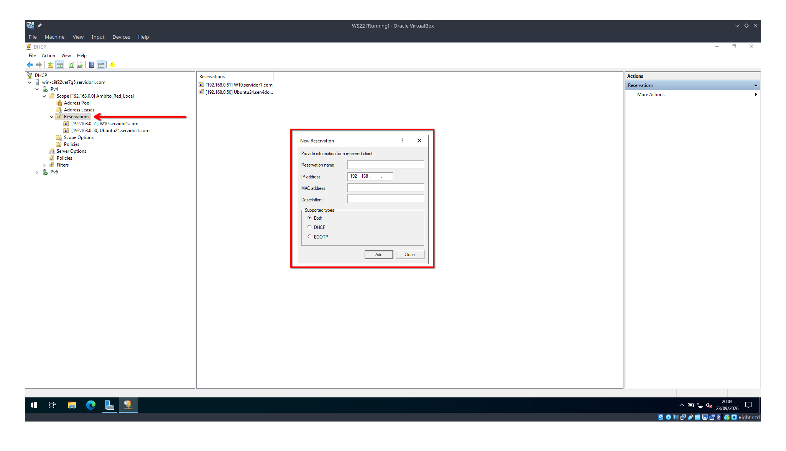

Procedimiento: `DHCP > Scope > Reservations > New Reservation > Nombre + IP + MAC > Add`. Luego, en cada cliente, renovar la concesión:

```bash
# Linux
sudo dhclient -r && sudo dhclient
ip a
ping servidor1.com
```

```cmd
:: Windows
ipconfig /release
ipconfig /renew
ipconfig /all
```

**Figura 26 — Verificación en Linux con `ip a`: el equipo posee la IP terminada en `.50`.**


> **Nota:** Si la reserva no se aplica, verificar que la MAC ingresada no contenga guiones ni errores de transcripción, que el ámbito esté activado y que no exista una exclusión que cubra la IP reservada.

**Referencias:**
- [DHCP Overview — Microsoft Learn](https://learn.microsoft.com/en-us/windows-server/networking/technologies/dhcp/dhcp-top)
- [Manage DHCP scopes](https://learn.microsoft.com/en-us/windows-server/networking/technologies/dhcp/dhcp-manage-scope)

---

## 1.4 Servidor de Archivos y Recursos Compartidos (File Server)

### 1.4.1 ¿Para qué sirve?

El File Server centraliza documentos y recursos mediante el protocolo **SMB/CIFS** (*Server Message Block*), el estándar de Windows para carpetas compartidas en red. El acceso se controla en dos capas complementarias:

1. **Permisos de recurso compartido (*Share permissions*):** controlan el acceso a través de la red (`Everyone: Full Control` vs. usuarios específicos).
2. **Permisos NTFS (*Security*):** controlan el acceso a nivel de sistema de archivos (lectura, escritura, modificación, control total), incluso en acceso local. Aplican ACL (*Access Control Lists*).

**Regla efectiva:** el permiso real es el más restrictivo entre ambas capas. Por ello deben configurarse de forma coherente.

- **CarpetaPrivada:** acceso restringido. Credenciales exclusivas `privado/privado` con permisos de lectura, modificación y eliminación.
- **CarpetaPública:** abierta a todos los usuarios del dominio, con permisos de lectura, creación, modificación y eliminación.

> **Nota de adecuación del laboratorio:** para demostrar la denegación, la carpeta privada se restringió a `usuario1` (control total) sin conceder acceso a `usuario2`. El modelo es equivalente al especificado (`usuario exclusivo con control total`); si se requiere conformidad literal, crear el usuario `privado` en AD y sustituirlo por `usuario1` en los pasos siguientes. El procedimiento de permisos es idéntico.

### 1.4.2 Estructura base

En la raíz del servidor (ej. `C:\`) se creó el directorio **`ServiciosArchivos`**, contenedor de los dos recursos.

**Figura 27 — Raíz del servidor Windows Server 2022 donde se crea la estructura.**

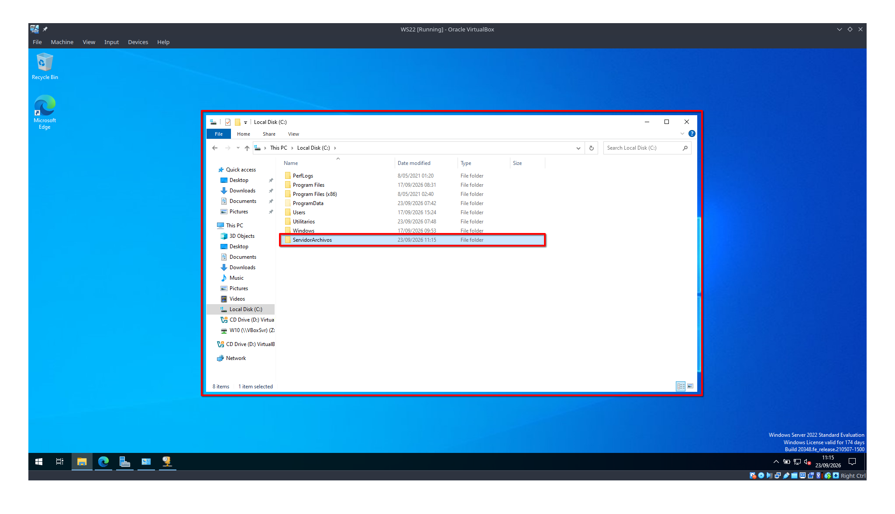

**Figura 28 — Carpetas `Publica` y `Privada` dentro de `ServiciosArchivos`.**

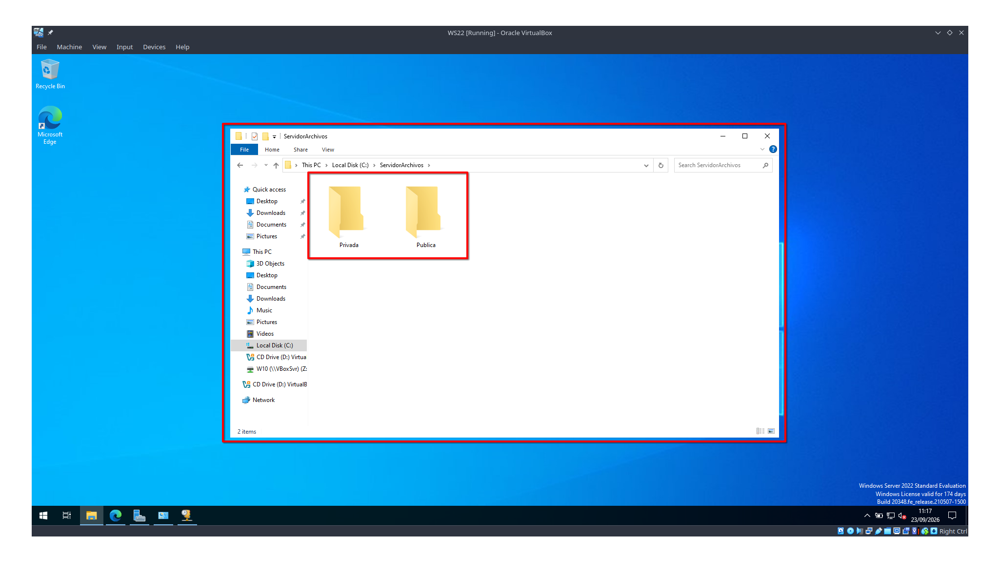

Ruta física sugerida:

```text
C:\ServiciosArchivos\Publica
C:\ServiciosArchivos\Privada
```

### 1.4.3 Configuración — Carpeta pública

1. Clic derecho sobre `Publica > Properties > Sharing > Advanced Sharing > Share this folder`. Nombre de recurso: `Publica`.
2. En *Permissions*, conceder a **Everyone: Full Control / Change / Read**. Este directorio no requiere permisos especiales; cualquier usuario autenticado (`usuario1`, `usuario2`) puede acceder.

**Figura 29 — Propiedades de uso compartido de la carpeta pública.**

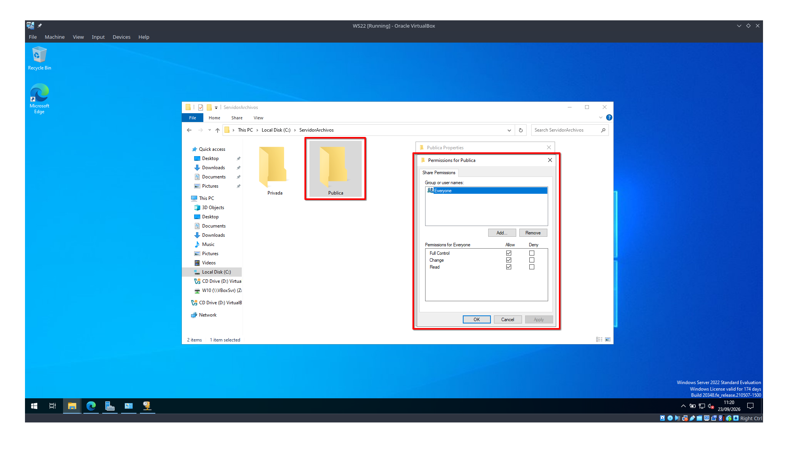

3. En la pestaña *Security*, conceder control total a usuarios autenticados para que NTFS no bloquee lo permitido en *Share*.

**Figura 30 — Pestaña Seguridad de la carpeta pública (control total).**

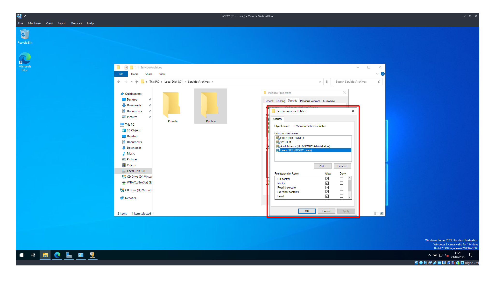

### 1.4.4 Configuración — Carpeta privada

1. Repetir el proceso de compartición para `Privada`, pero en *Share Permissions* otorgar control total únicamente a `usuario1` (o al usuario `privado` si se implementa la variante literal). Eliminar o no incluir a `Everyone` ni a `usuario2`.

**Figura 31 — Propiedades de uso compartido de la carpeta privada.**

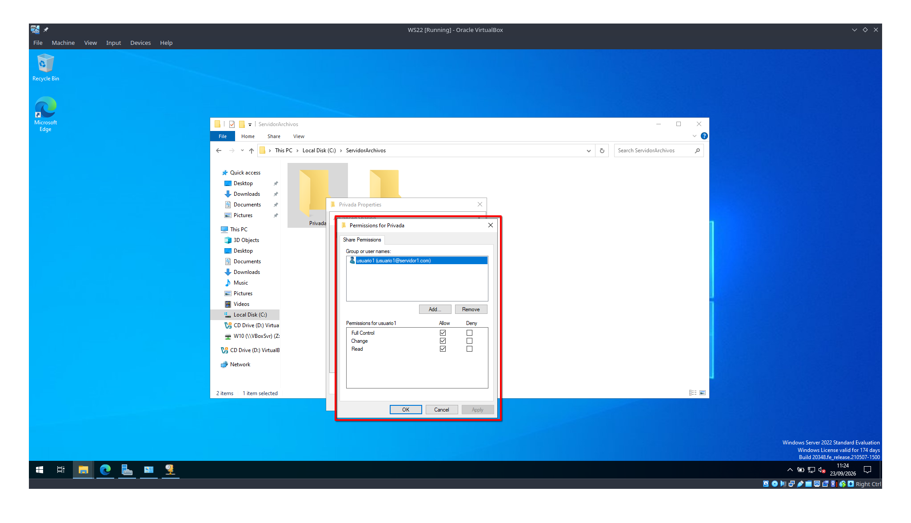

2. En *Security*, remover permisos generales heredados y otorgar control total solo a los usuarios autorizados (y a `Administrators`/`SYSTEM` para administración). Esto garantiza que, aunque alguien adivine la ruta UNC, NTFS deniegue el acceso.

**Figura 32 — Pestaña Seguridad de la carpeta privada (solo usuarios específicos).**

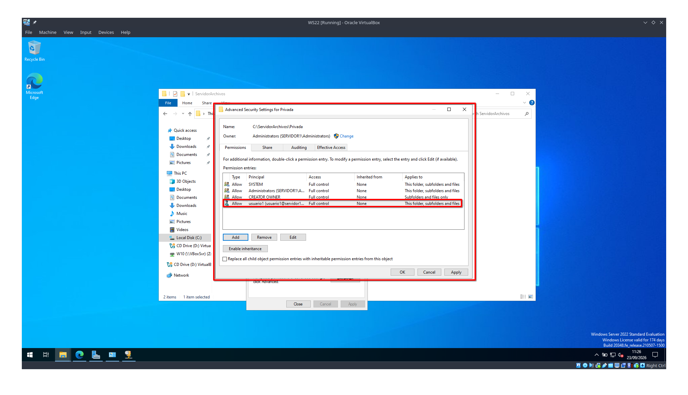

> **Advertencia:** No basta con configurar solo *Share*; si NTFS conserva `Everyone`, el recurso queda expuesto en acceso local o ante reconfiguraciones. Siempre deben revisarse ambas pestañas.

### 1.4.5 Verificación desde clientes

#### Cliente Windows (con `usuario2`)

Desde el Explorador de archivos acceder a la IP del dominio:

```text
\\192.168.0.20\
```

**Figura 33 — En la ruta se observan `Publica` y `Privada`.**

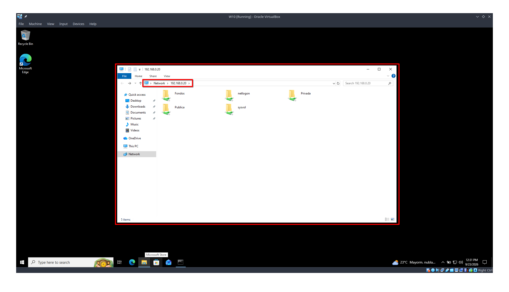

- Al abrir `Publica` no hay restricción; se visualiza su contenido.
- Al abrir `Privada` con `usuario2` (no autorizado) el sistema muestra **Acceso denegado**, lo que confirma que la ACL funciona.

**Figura 34 — Acceso denegado a la carpeta privada para `usuario2`.**

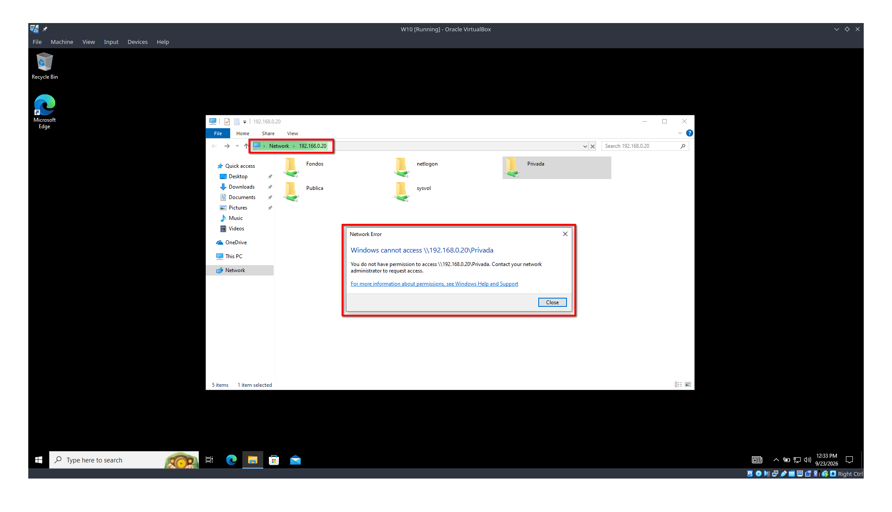

#### Cliente Linux

Desde el gestor de archivos (Nautilus) acceder vía SMB:

```text
smb://192.168.0.20/Publica
smb://192.168.0.20/Privada
```

Autenticarse con credenciales de dominio cuando se solicite (`usuario2` para pública, `usuario1` para privada).

**Figura 35 — Carpeta pública con archivos disponibles (acceso con `usuario2`).**

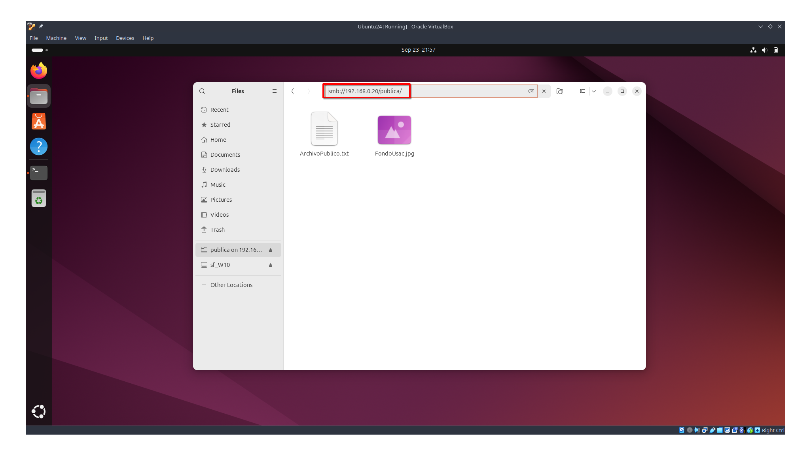

**Figura 36 — Carpeta privada con su contenido (acceso con `usuario1`).**

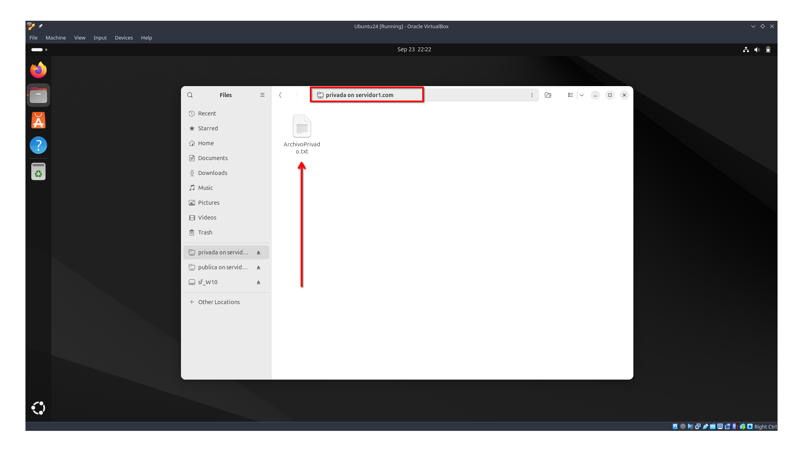

Alternativamente puede montarse por terminal:

```bash
# Acceso temporal con gio
gio mount smb://usuario1@servidor1.com/Privada

# Montaje persistente (requiere cifs-utils)
sudo apt install -y cifs-utils
sudo mount -t cifs //192.168.0.20/Publica /mnt/publica -o username=usuario2,domain=servidor1
```

#### Nota sobre acceso por nombre DNS

También es posible acceder mediante el nombre `servidor1.com` en lugar de la IP:

```text
\\servidor1.com\Publica
smb://servidor1.com/Publica
```

**Figura 37 — Acceso utilizando `servidor1.com` en lugar de la IP.**

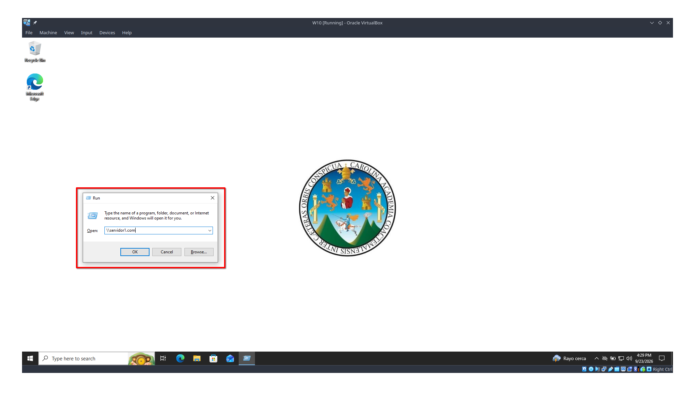

Comportamiento observado:

- **En Linux** funciona correctamente.
- **En el cliente Windows del laboratorio** la ruta abre y muestra los directorios, pero no lista los archivos almacenados (comportamiento anómalo específico del entorno, posiblemente por caché de credenciales, resolución LLMNR o perfil de red).

**Figura 38 — Ruta por nombre: se visualizan los directorios, pero no su contenido (limitación observada en Windows).**

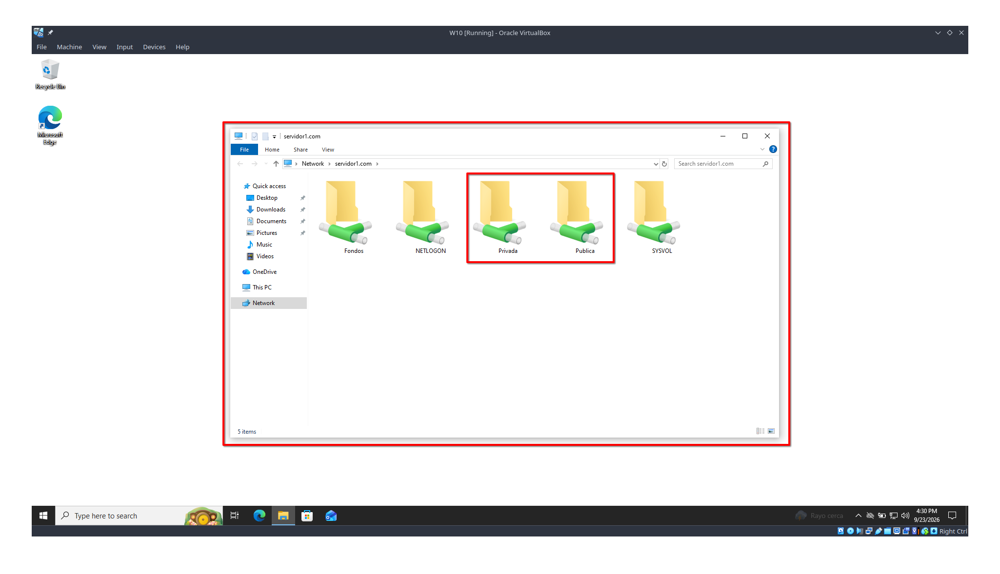

> **Recomendación para la defensa:** demostrar primero `ping servidor1.com` (prueba DNS), luego acceso SMB por IP y finalmente por nombre, explicando la limitación detectada. Esto evidencia dominio técnico y honestidad en los resultados.

**Referencias:**
- [SMB in Windows Server — Microsoft Learn](https://learn.microsoft.com/en-us/windows-server/storage/file-server/file-server-smb-overview)
- [Share and NTFS permissions](https://learn.microsoft.com/en-us/windows-server/storage/file-server/ntfs-overview)
- [Samba / CIFS (Ubuntu)](https://ubuntu.com/server/docs/samba-introduction)

---

## 1.5 Servidor de Correo Electrónico

> **Objetivo de la sección:** Desplegar la infraestructura de correo del dominio `servidor1.com` (SMTP/IMAP/POP3) con hMailServer sobre Windows, autenticando las cuentas directamente contra Active Directory, y configurando Mozilla Thunderbird en el cliente Ubuntu como MUA por IMAP y SMTP.

### ¿Para qué sirve?

El correo electrónico interno permite la comunicación formal entre usuarios del dominio sin depender de servicios externos. La arquitectura combina tres protocolos: **SMTP** (puerto 25, envío), **IMAP** (puerto 143, lectura sincronizada del buzón) y **POP3** (puerto 110, descarga). La integración con AD evita duplicar contraseñas: hMailServer delega la validación al controlador de dominio.

**Requisitos previos:** dominio `servidor1.com` funcional (1.2), usuarios de correo creados en AD, conectividad del cliente Linux al servidor (`ping servidor1.com`) y puertos 25/110/143 habilitados en el Firewall de Windows.

### 1.5.1 Registros DNS para correo (MX y A)

Sin registros DNS, los clientes no pueden localizar el servidor de correo por nombre (`mail.servidor1.com`).

**Procedimiento (`dnsmgmt.msc > Zonas de búsqueda directa > servidor1.com`):**

1. Verificar la zona directa `servidor1.com`.

**Figura 39 — Zona de búsqueda directa `servidor1.com` en la consola DNS.**

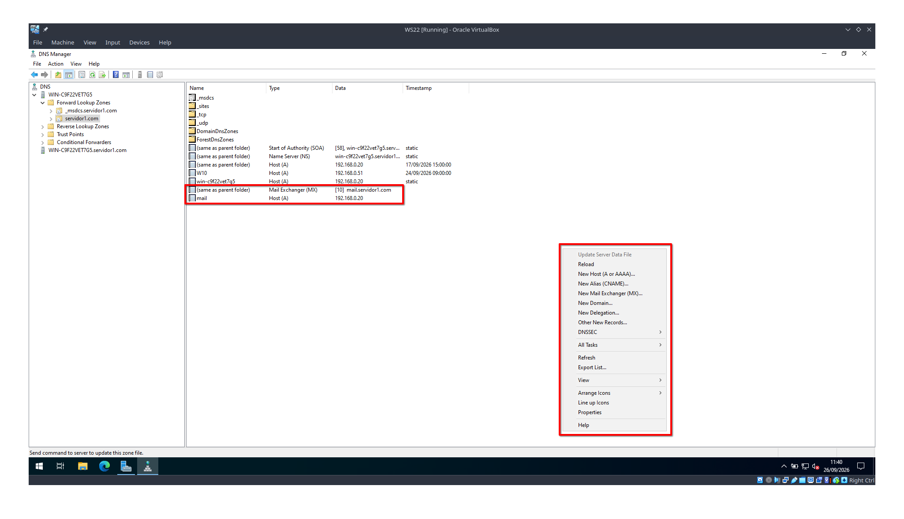

2. Crear el registro **MX (Mail Exchanger)**: clic derecho en el área blanca → **Intercambiador de correo nuevo (MX)**. Dejar *Host o dominio secundario* en blanco y escribir como FQDN del servidor de correo `mail.servidor1.com`.

**Figura 40 — Creación del registro MX hacia `mail.servidor1.com`.**

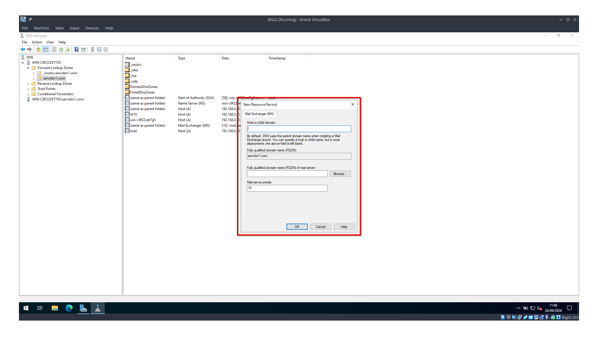

3. Crear el registro **A para `mail`**: clic derecho → **Host nuevo (A o AAAA)**, nombre `mail`, dirección IP `192.168.0.20`, **Agregar host**.

**Figura 41 — Registro A `mail → 192.168.0.20`.**

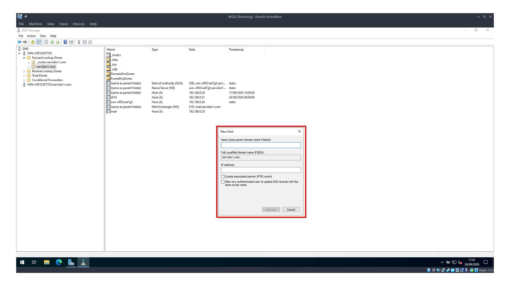

> **Nota:** El registro MX indica *qué host* recibe el correo del dominio; el registro A indica *qué IP* corresponde a ese host. Ambos son necesarios.

### 1.5.2 Cuentas de correo en Active Directory

Especificación (§1.5.3 del enunciado):

| Cuenta | Dirección | Contraseña |
|---|---|---|
| correo1 | correo1@servidor1.com | Password1 |
| correo2 | correo2@servidor1.com | Password1 |

> **Nota:** La especificación indica `Password`, pero se utilizó `Password1` por la política de complejidad del servidor (ver 1.2.3).

**Procedimiento (`dsa.msc`):** crear los usuarios **`correo1`** y **`correo2`** en la Unidad Organizativa, definir su campo *E-mail* (`correo1@servidor1.com`, `correo2@servidor1.com`) y asignarles `Password1`.

**Figura 42 — Usuarios `correo1` y `correo2` con su dirección de correo en AD.**

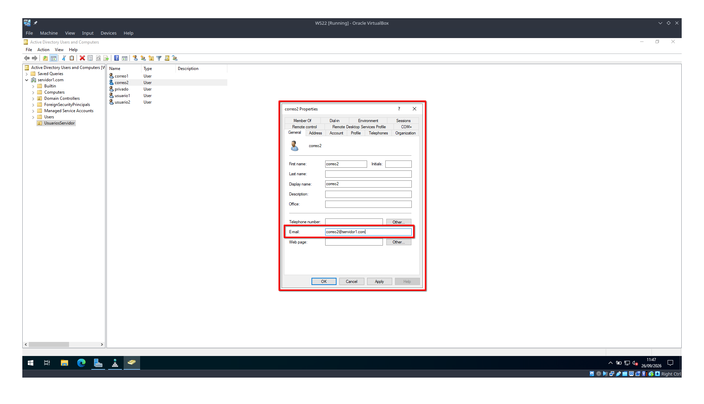

### 1.5.3 Instalación y configuración de hMailServer

**¿Por qué hMailServer?** Es la solución contemplada en el enunciado para Windows, con soporte de SMTP/IMAP/POP3 e integración nativa con Active Directory.

1. Descargar el instalador de **hMailServer** y ejecutarlo en Windows Server.

**Figura 43 — Instalador de hMailServer en el servidor.**

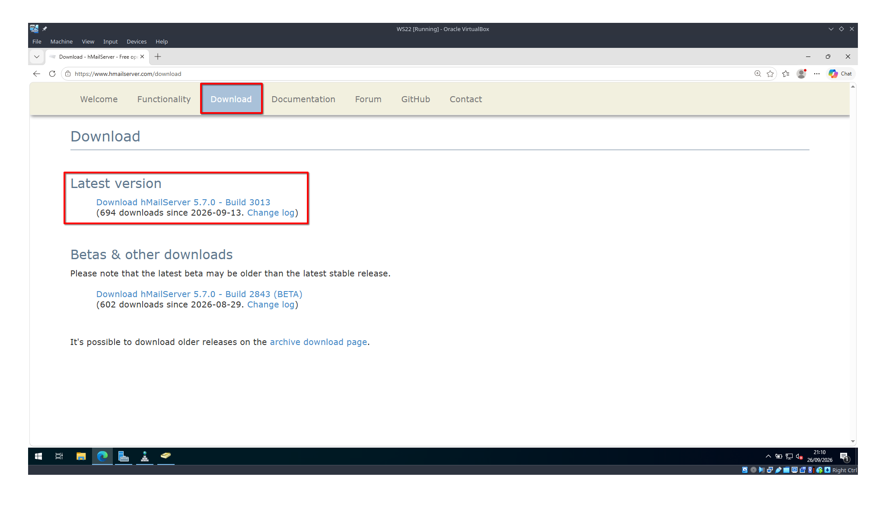

2. Durante la instalación seleccionar la base de datos embebida (**Built-in database engine – Microsoft SQL Compact**) y definir la contraseña de administración.

**Figura 44 — Selección de base de datos embebida y contraseña de administración.**

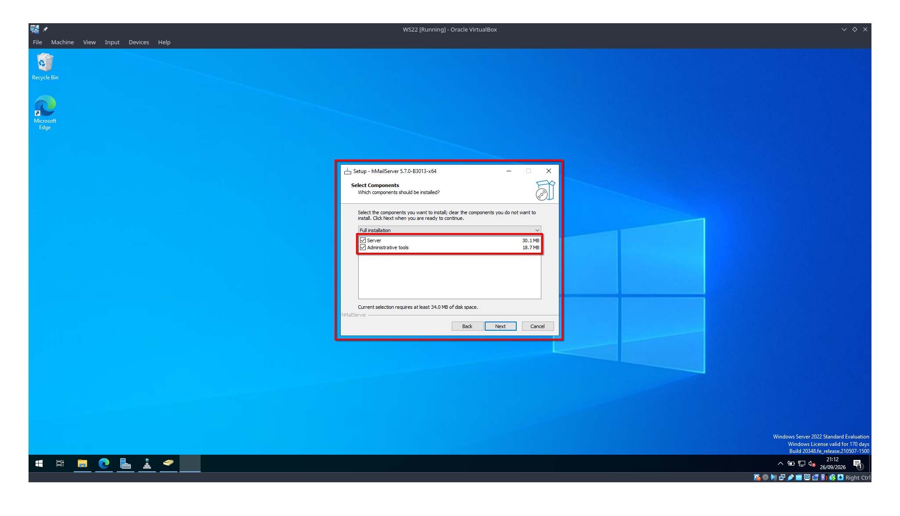

3. Abrir **hMailServer Administrator**, seleccionar **localhost → Connect** e ingresar la contraseña de administración.

**Figura 45 — Conexión del Administrator a localhost.**

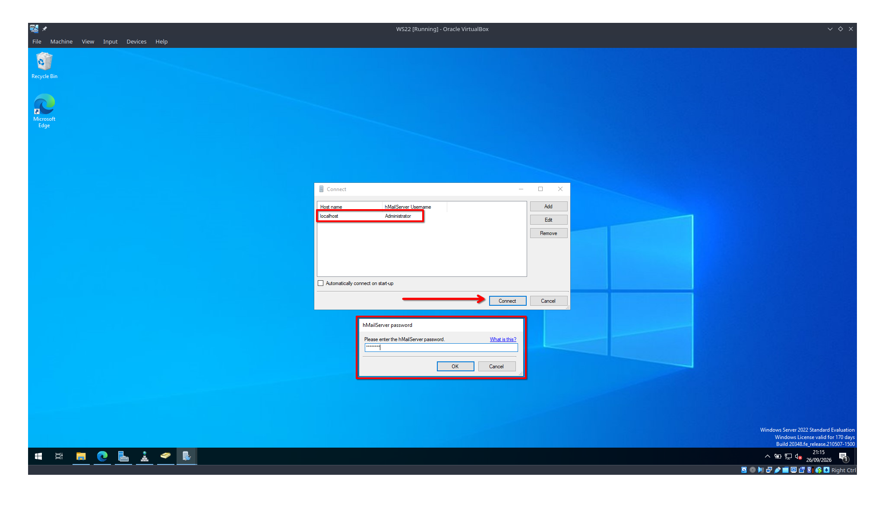

4. Crear el dominio: **Domains → Add**, campo **Domain:** `servidor1.com`, **Save**.

**Figura 46 — Dominio `servidor1.com` creado en hMailServer.**

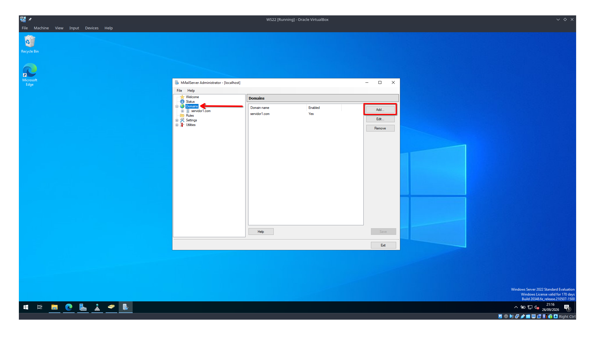

5. Habilitar la autenticación contra AD: desplegar **Domains → `servidor1.com` → pestaña Active Directory**, marcar **Enable Active Directory authentication**, *Domain name:* `servidor1.com`, *Server address:* `127.0.0.1` (o `192.168.0.20`), **Save**.

**Figura 47 — Autenticación de hMailServer delegada a Active Directory.**

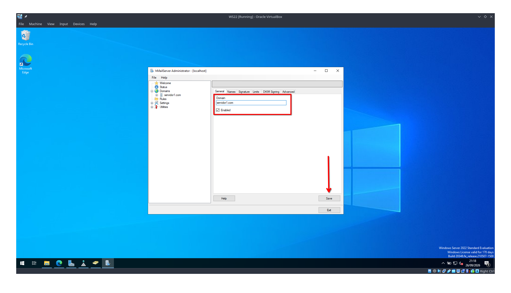

6. Crear los buzones vinculados a AD: **Domains → `servidor1.com` → Accounts → Add**.

**Figura 48 — Alta de cuentas en el dominio de correo.**

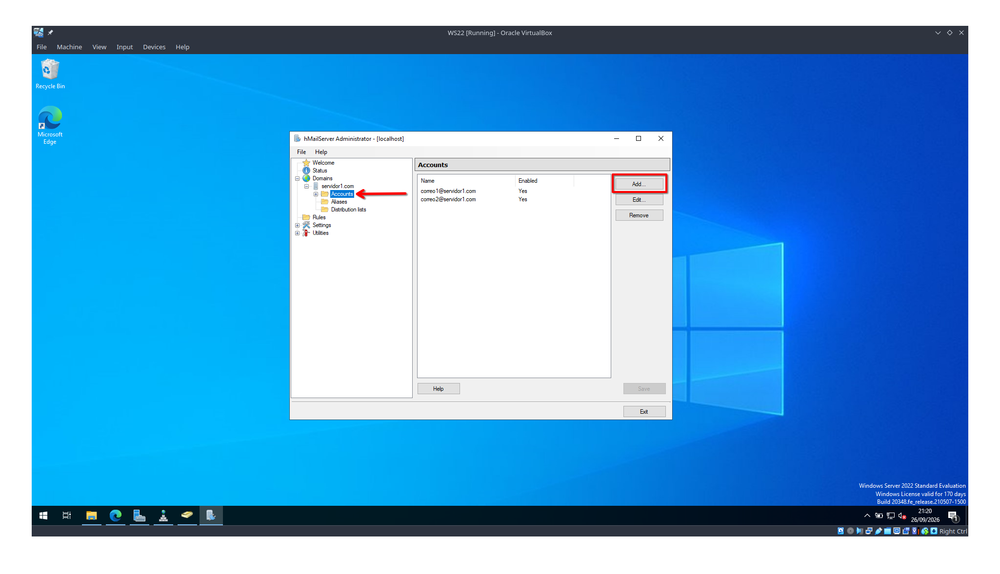

7. En la pestaña **General**, *Address:* `correo1` (completa automáticamente `@servidor1.com`). El campo de contraseña puede quedar temporal, porque la validación real la hará AD.

**Figura 49 — Dirección `correo1@servidor1.com` en la pestaña General.**

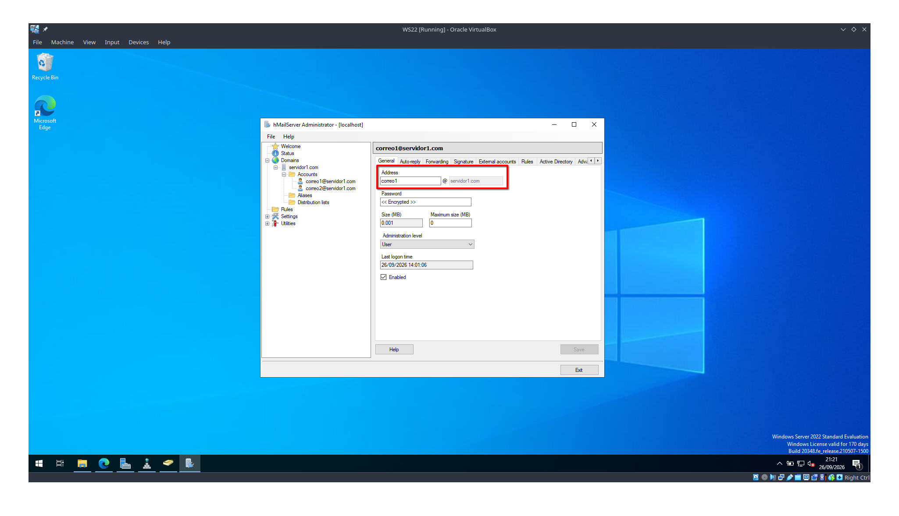

8. En la pestaña **Active Directory**, marcar **Active Directory account** y escribir *User name:* `correo1@servidor1.com`. **Save**. Repetir el proceso para `correo2` (`Address: correo2`, `User name: correo2@servidor1.com`).

**Figura 50 — Vinculación de `correo1` con su cuenta de AD.**

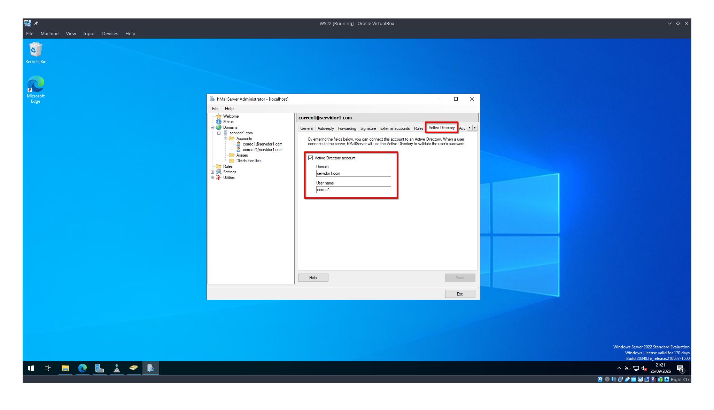

9. Verificar protocolos: **Settings → Advanced → TCP/IP ports**. Deben aparecer habilitados **SMTP 25**, **IMAP 143** y **POP3 110**.

10. Abrir los puertos en el Firewall de Windows (PowerShell como administrador):

```powershell
New-NetFirewallRule -DisplayName "hMailServer Ports" -Direction Inbound -Protocol TCP -LocalPort 25,110,143 -Action Allow
```

> Sin esta regla, el cliente Ubuntu no puede alcanzar los puertos de correo aunque el servicio esté en ejecución.

**Referencias:**
- [hMailServer — Documentation](https://www.hmailserver.com/documentation)
- [hMailServer — Active Directory integration](https://www.hmailserver.com/documentation/latest/?page=reference_domain_active_directory)

### 1.5.4 Cliente Mozilla Thunderbird en Ubuntu Linux

**¿Para qué sirve?** Thunderbird (MUA, *Mail User Agent*) es el cliente exigido para acceder a ambos buzones por IMAP/POP3 y SMTP desde Linux, demostrando una funcionalidad del cliente Linux unido al dominio.

Instalación:

```bash
sudo apt update && sudo apt install -y thunderbird
```

Configuración de `correo1@servidor1.com`:

1. Abrir Thunderbird e ingresar nombre (`Correo 1`) y dirección (`correo1@servidor1.com`). Hacer clic en **Configurar manualmente**.

**Figura 51 — Alta manual de la primera cuenta en Thunderbird.**


2. Seleccionar **IMAP** y continuar (*Set up account*).

**Figura 52 — Selección de IMAP como protocolo entrante.**


3. Completar los parámetros (repetir la misma lógica para la segunda cuenta cambiando `correo1` por `correo2`):

- **Entrante (IMAP):** servidor `mail.servidor1.com` (o `192.168.0.20`), puerto `143`, sin SSL (*None*), autenticación *Normal password*, usuario `correo1` (o `correo1@servidor1.com`).
- **Saliente (SMTP):** servidor `mail.servidor1.com` (o `192.168.0.20`), puerto `25`, sin SSL, autenticación *Normal password*, usuario `correo1`.
- **Contraseña:** la de Active Directory (`Password1`).

**Figura 53 — Parámetros IMAP/SMTP hacia `mail.servidor1.com`.**


**Figura 54 — Confirmación de la cuenta configurada.**


Para `correo2@servidor1.com`: **Ajustes (engranaje) → Ajustes de la cuenta → Acciones de la cuenta → Añadir cuenta de correo** y repetir los datos con `correo2`, servidores `mail.servidor1.com`, puertos `143` y `25`.

### 1.5.5 Prueba de envío y recepción

1. En Thunderbird, redactar un mensaje con remitente **`correo1@servidor1.com`** y destinatario **`correo2@servidor1.com`**.

**Figura 55 — Mensaje de prueba de `correo1` hacia `correo2`.**

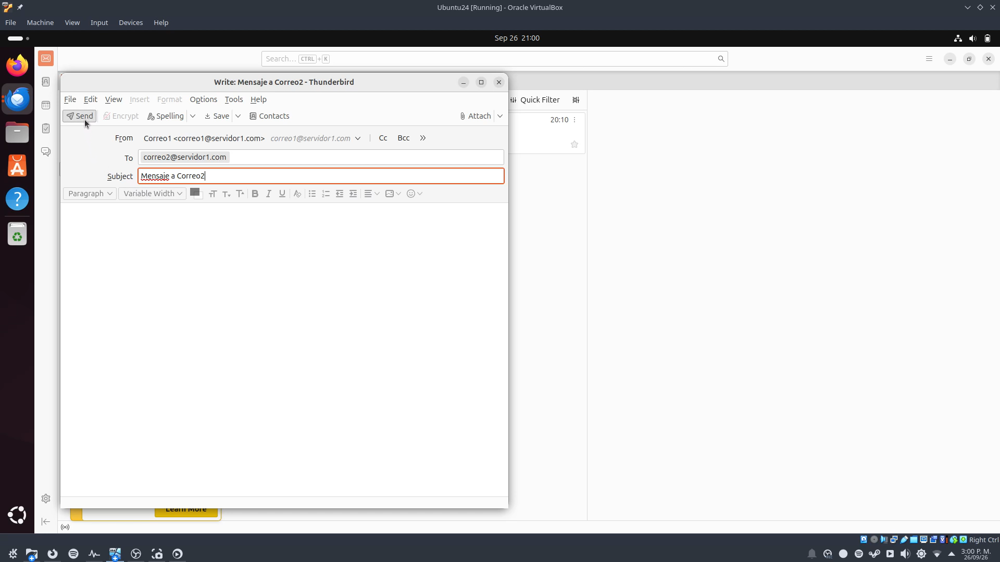

2. Abrir la bandeja de entrada de **`correo2@servidor1.com`** y verificar la llegada del mensaje.

**Figura 56 — Recepción verificada en el buzón de `correo2`.**

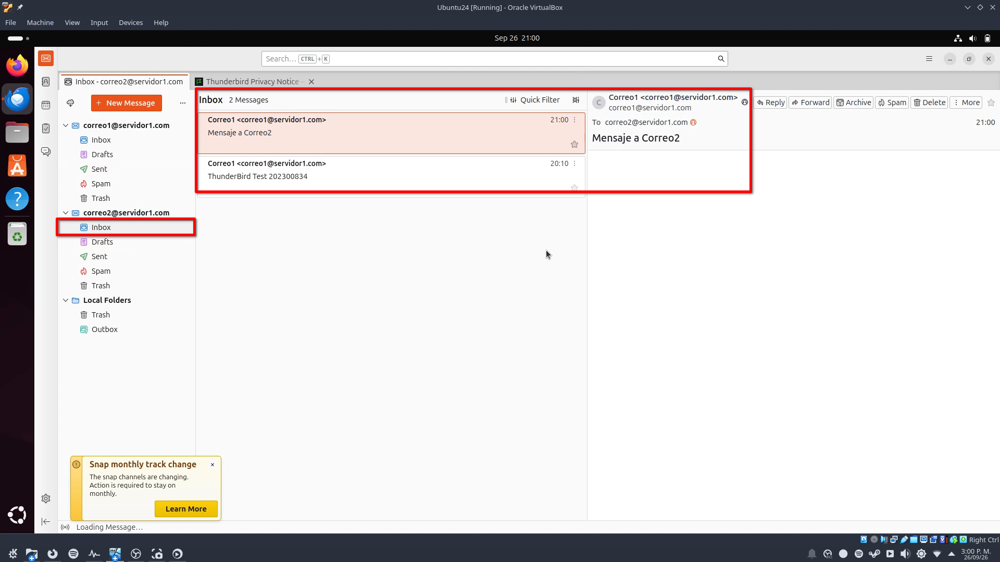

> Con la llegada del mensaje queda verificado de extremo a extremo el flujo SMTP (envío) + IMAP (lectura) con autenticación AD.

---

## 1.6 Servidor Web (Internet Information Services – IIS 10.0)

> **Objetivo de la sección:** Publicar en IIS los sitios `publicweb` (público), `privadaweb` (restringido con autenticación, obligatoriamente en puerto 1080) y la redirección `correo` hacia el webmail mediante HTTP Redirect nativo de IIS.

### ¿Para qué sirve?

IIS es el servidor web de Windows Server. Permite hospedar contenido HTTP interno (documentación, portales) con control de acceso por sitio: un área pública sin autenticación, un área privada con autenticación Basic/Windows y un alias de acceso directo (`/correo`) que redirige al servicio de correo.

Especificación:

| Sitio | URL | Ruta física | Acceso |
|---|---|---|---|
| publicweb | `http://192.168.0.20/publicweb` | `C:\Inetpub\wwwroot\publicweb` | Público, mensaje “Carpeta Pública” |
| privadaweb | `http://192.168.0.20:1080/privadaweb` | `C:\Inetpub\wwwroot\privadaweb` | Restringido (Basic/Windows, usuario `privado`), mensaje “Carpeta Privada”, puerto 1080 obligatorio |
| correo | `http://192.168.0.20/correo` | `C:\Inetpub\wwwroot\correo` | HTTP Redirect al webmail (prohibido redirigir por código HTML/JS/PHP) |

### 1.6.1 Instalación del rol Web Server (IIS)

**Requisito previo:** rol Web Server disponible; se requieren los servicios de rol de *Security* (Basic + Windows Authentication) y *HTTP Redirection*.

1. **Server Manager → Manage → Add Roles and Features**, tipo *Role-based or feature-based installation*, seleccionar el servidor y marcar **Web Server (IIS) → Add Features**.

**Figura 57 — Selección del rol Web Server (IIS).**


2. En **Role Services** marcar en *Security* **Basic Authentication** y **Windows Authentication**, y en *Common HTTP Features* **HTTP Redirection**. **Install** y esperar a que finalice.

**Figura 58 — Servicios de rol: autenticación y redirección HTTP.**


### 1.6.2 Sitios publicweb y privadaweb

1. En `C:\Inetpub\wwwroot\` crear las carpetas `publicweb` y `privadaweb`. En cada una crear `index.html`: un `h1` con “Carpeta Pública” y otro con “Carpeta Privada”, respectivamente.

**Figura 59 — Estructura `publicweb` / `privadaweb` con sus `index.html`.**

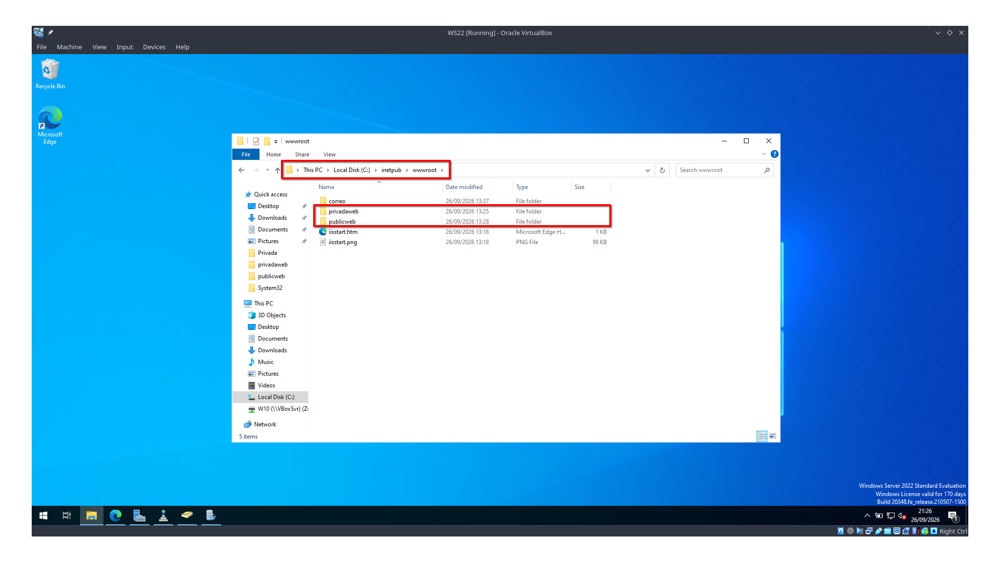

2. Abrir **IIS Manager** (`inetmgr`).

**Figura 60 — Consola Internet Information Services (IIS) Manager.**

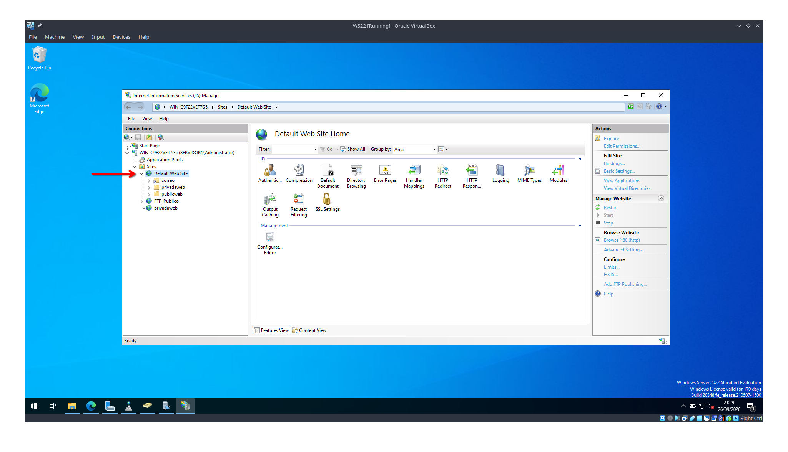

3. **publicweb:** desplegar *Servidor → Sites → Default Web Site*. Si las carpetas no aparecen como subdirectorios, clic derecho sobre **Default Web Site → Add Virtual Directory**, alias `publicweb`, ruta física `C:\Inetpub\wwwroot\publicweb`. Hereda el enlace del sitio predeterminado (puerto 80).

4. **privadaweb (puerto 1080 obligatorio):** clic derecho sobre **Sites → Add Website**, *Site name:* `privadaweb`, *Physical path:* `C:\Inetpub\wwwroot\privadaweb`, *Binding:* Type `http`, IP *All Unassigned* (o `192.168.0.20`), Port **`1080`**, **OK**.

**Figura 61 — Sitio `privadaweb` enlazado al puerto 1080.**

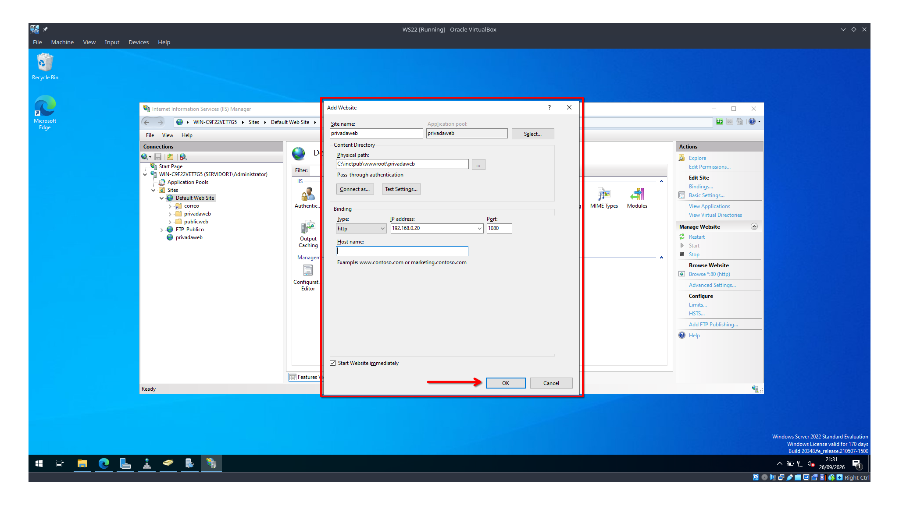

5. Seguridad en IIS: seleccionar el sitio **`privadaweb` → Authentication**.

**Figura 62 — Panel Authentication del sitio `privadaweb`.**

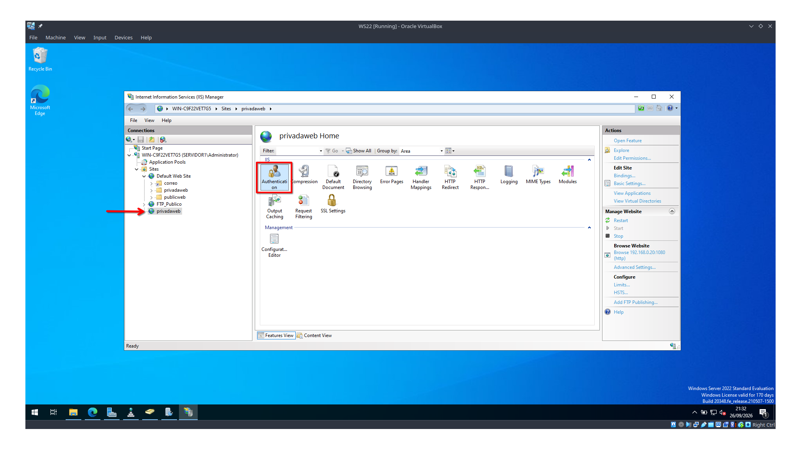

6. **Deshabilitar** *Anonymous Authentication* y **habilitar** *Basic Authentication* (o *Windows Authentication*).

**Figura 63 — Anónima deshabilitada y autenticación Basic habilitada.**

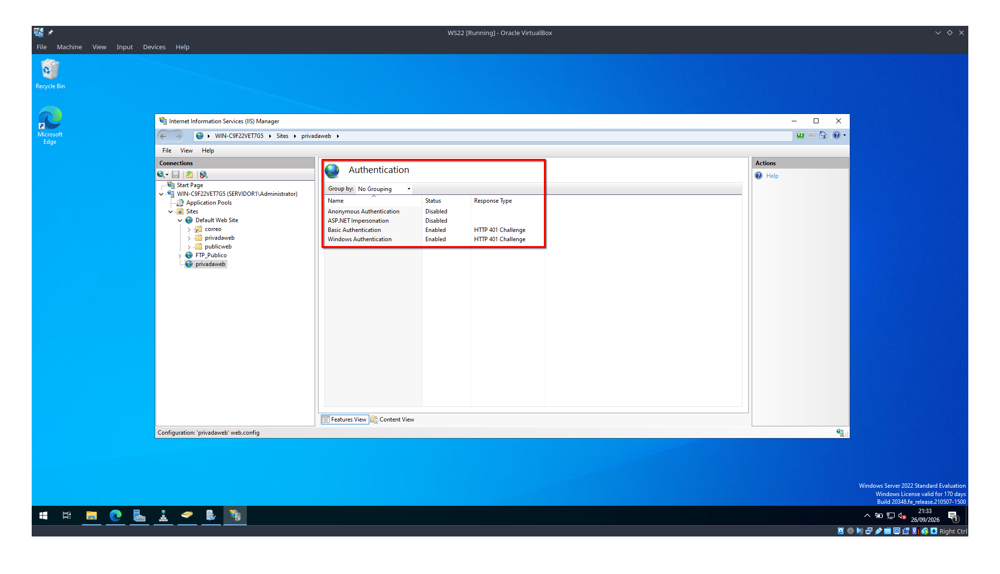

7. En la carpeta física `C:\Inetpub\wwwroot\privadaweb` (clic derecho → Propiedades → Seguridad) otorgar lectura al usuario autorizado.

**Figura 64 — Permiso NTFS de lectura al usuario autorizado.**

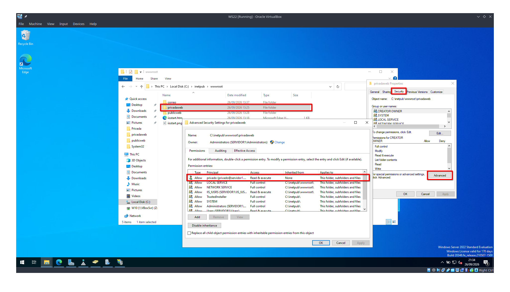

> **Nota de adecuación:** el enunciado exige el usuario `privado/privado`. Si en el laboratorio solo existen `usuario1`/`usuario2` (ver 1.4.1), otorgar el permiso al usuario autorizado equivalente (`usuario1`) o crear `privado` en AD; el procedimiento es idéntico.

### 1.6.3 Redirección de correo (`correo`)

1. En IIS Manager seleccionar **Default Web Site → Add Virtual Directory** (o crear la carpeta `C:\Inetpub\wwwroot\correo`), alias `correo`, ruta física `C:\Inetpub\wwwroot\correo`.

**Figura 65 — Directorio virtual `correo` en el sitio predeterminado.**

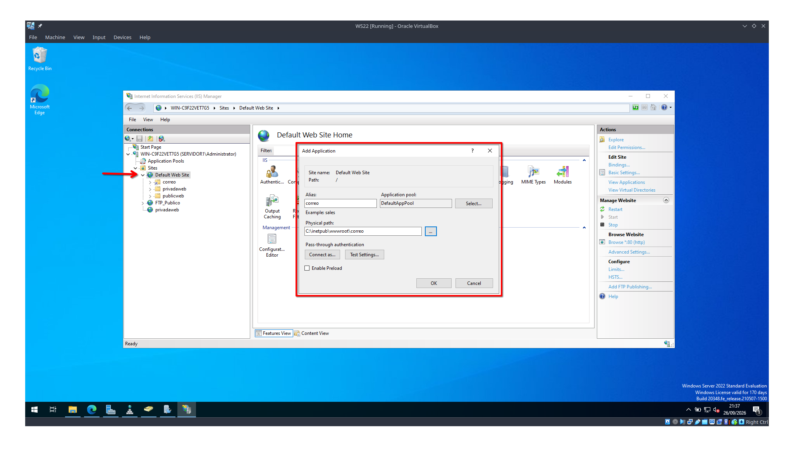

2. Seleccionar la carpeta **`correo`** y abrir **HTTP Redirect**.

**Figura 66 — Función HTTP Redirect de IIS.**

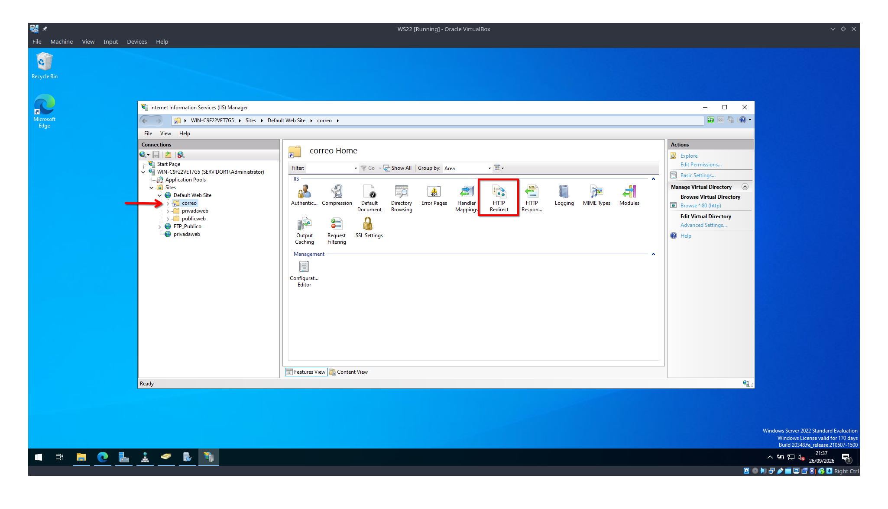

3. Marcar **Redirect requests to this destination**, escribir la URL del webmail (por ejemplo `http://192.168.0.20:8080` o la interfaz que corresponda), marcar **Redirect all requests to exact destination** y **Apply**.

**Figura 67 — Redirección configurada hacia el webmail.**

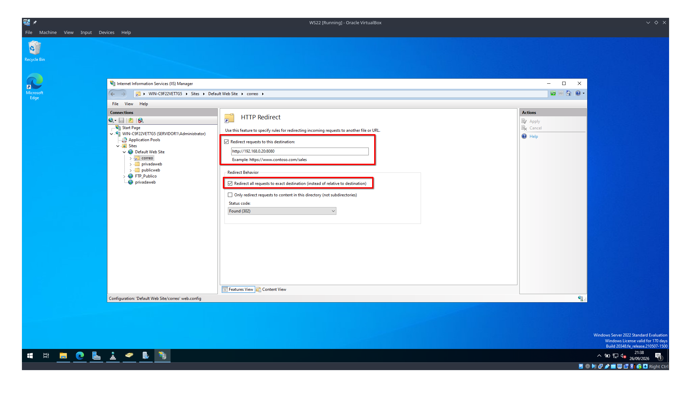

> La redirección debe realizarse a nivel de IIS. Está prohibido implementarla con código (HTML, JS, PHP): el servidor debe responder con un código de redirección HTTP (p. ej. 302).

4. Abrir el puerto 1080 en el Firewall (**Windows Defender Firewall with Advanced Security → Inbound Rules → New Rule → Port → TCP 1080 → Allow the connection**, todos los perfiles, nombre `IIS Puerto 1080`).

**Figura 68 — Regla de entrada para el puerto TCP 1080.**

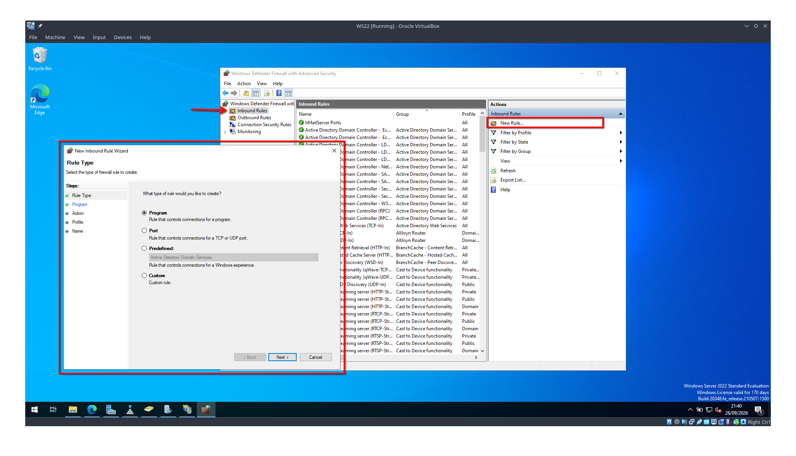

### 1.6.4 Verificación de sitios

- **publicweb (puerto 80):** navegar a `http://192.168.0.20/publicweb` y verificar el mensaje “Carpeta Pública”.

**Figura 69 — Sitio `publicweb` accesible sin autenticación.**

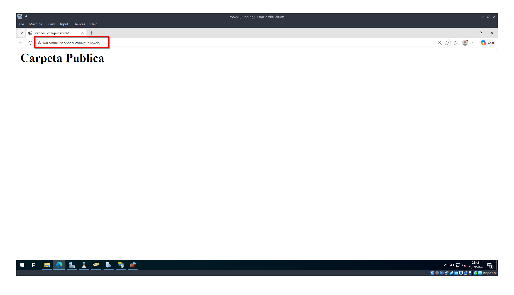

- **privadaweb (puerto 1080 con autenticación):** navegar a `http://192.168.0.20:1080/privadaweb`. El navegador solicita credenciales; autenticar con el usuario autorizado y verificar el mensaje “Carpeta Privada”.

**Figura 70 — Sitio `privadaweb` con solicitud de credenciales en el puerto 1080.**

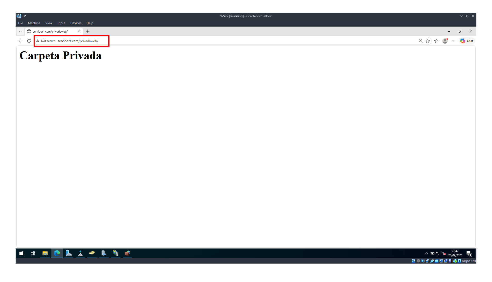

- **`/correo`:** al entrar a `http://192.168.0.20/correo`, IIS responde con una redirección HTTP (302) que envía automáticamente al webmail. Es un acceso directo, no contenido propio.

**Referencias:**
- [IIS Overview — Microsoft Learn](https://learn.microsoft.com/en-us/iis/get-started/introduction-to-iis/iis-web-server-overview)
- [HTTP Redirect — Microsoft Learn](https://learn.microsoft.com/en-us/iis/configuration/system.webserver/httpredirect/)

---

## 1.7 Servidor FTP

> **Objetivo de la sección:** Publicar el servicio FTP de IIS en Windows Server 2022 apuntando a la Carpeta Pública, permitiendo que `usuario1` y `usuario2` autentiquen con sus cuentas de dominio y operen con permisos de lectura y escritura.

### ¿Para qué sirve?

FTP (*File Transfer Protocol*) permite transferir archivos entre clientes y servidor con control de credenciales, complementando a SMB (1.4) en escenarios multiplataforma o de línea de comandos. En este diseño reutiliza las cuentas de AD y la misma ruta física de la Carpeta Pública.

**Requisitos previos:** Carpeta Pública existente (1.4, ruta `C:\ServiciosArchivos\Publica`), usuarios de dominio operativos y puerto 21 habilitado en el Firewall.

### 1.7.1 Instalación del servicio FTP de IIS

1. **Server Manager → Manage → Add Roles and Features → Server Roles → Web Server (IIS) → FTP Server**, marcar **FTP Service** y **FTP Extensibility**, **Next → Install**.

**Figura 71 — Rol FTP Server (Service + Extensibility) de IIS.**

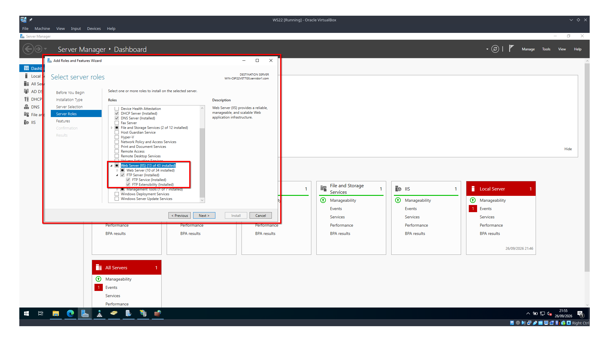

### 1.7.2 Sitio FTP_Publico

1. En **IIS Manager**, clic derecho sobre **Sites → Add FTP Site**. *FTP site name:* `FTP_Publico`, *Physical path:* la ruta exacta de la Carpeta Pública (en este laboratorio `C:\ServiciosArchivos\Publica`, la misma de 1.4.2), **Next**.

**Figura 72 — Sitio `FTP_Publico` apuntando a la Carpeta Pública.**

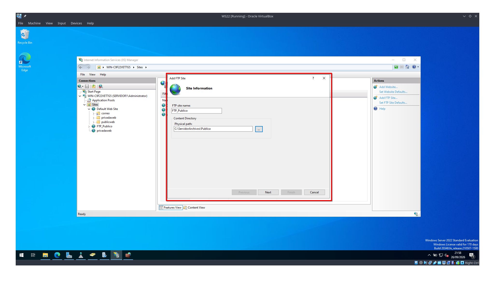

2. *Binding and SSL:* IP *All Unassigned* (o `192.168.0.20`), puerto `21` (estándar FTP), SSL **No SSL** (para facilitar la prueba en laboratorio), **Next**.

**Figura 73 — Enlace al puerto 21 sin SSL.**


3. *Authentication and Authorization:* autenticación **Basic** (sin *Anonymous*); autorización a usuarios especificados `usuario1, usuario2`; permisos **Read** y **Write**; **Finish**.

**Figura 74 — Autenticación Basic y autorización de lectura y escritura.**

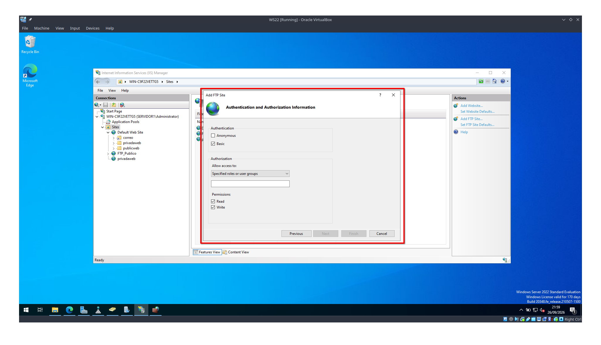

4. Verificar la autenticación de dominio: seleccionar el sitio **`FTP_Publico` → FTP Authentication**.

**Figura 75 — Panel FTP Authentication del sitio.**

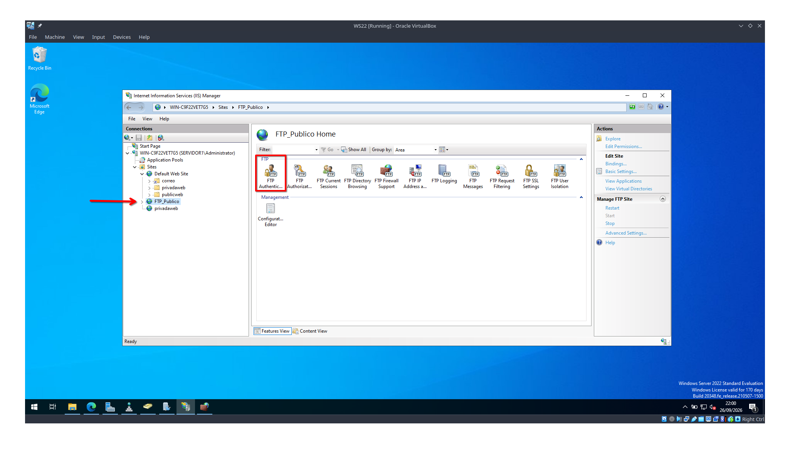

5. Confirmar que **Basic Authentication** está en **Enabled**, de modo que IIS valide `servidor1.com\usuario1` contra AD.

**Figura 76 — Basic Authentication habilitada.**

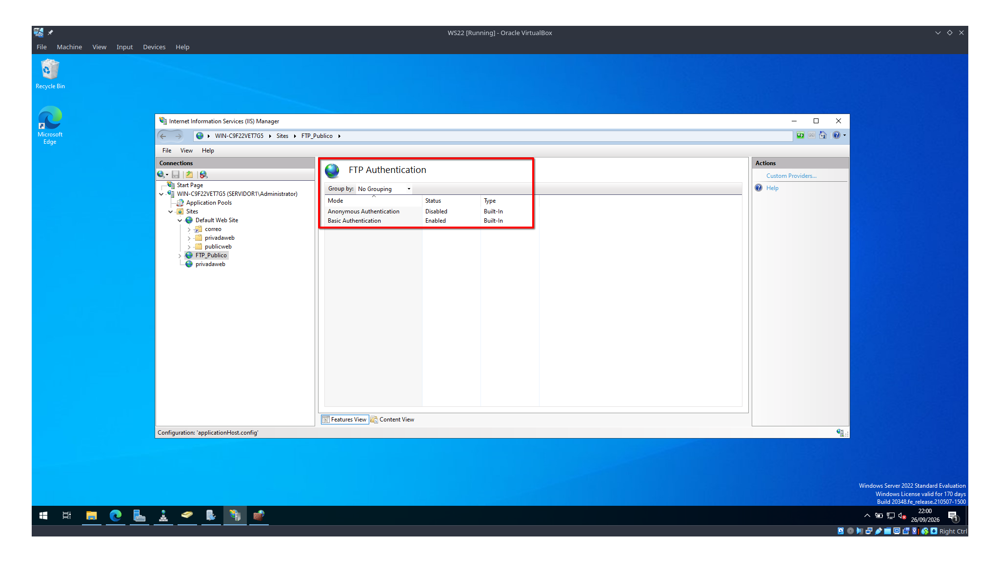

6. Habilitar el puerto en el Firewall: **Windows Defender Firewall → Inbound Rules → New Rule → Predefined → FTP Server**, habilitar las reglas (FTP Service Traffic-In, etc.) con **Allow the connection**.

**Figura 77 — Reglas predefinidas de FTP Server en el Firewall.**

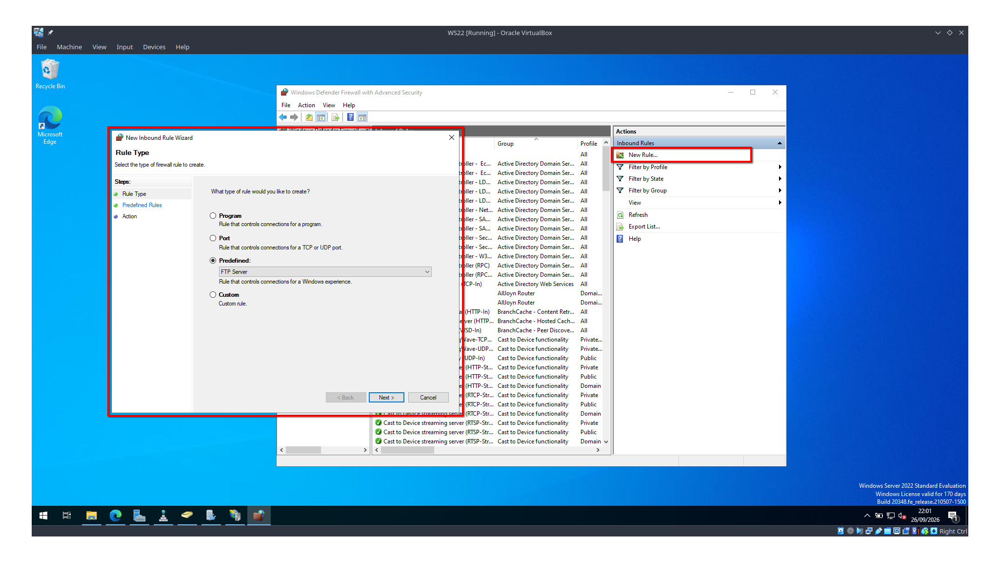

### 1.7.3 Verificación de transferencia

Desde la terminal (Linux o CMD de Windows) o con FileZilla/navegador:

```text
ftp 192.168.0.20
```

- Usuario: `usuario1@servidor1.com` (o `servidor1\usuario1`)
- Contraseña: `Password1`

**Figura 78 — Conexión FTP autenticada como `usuario1`.**

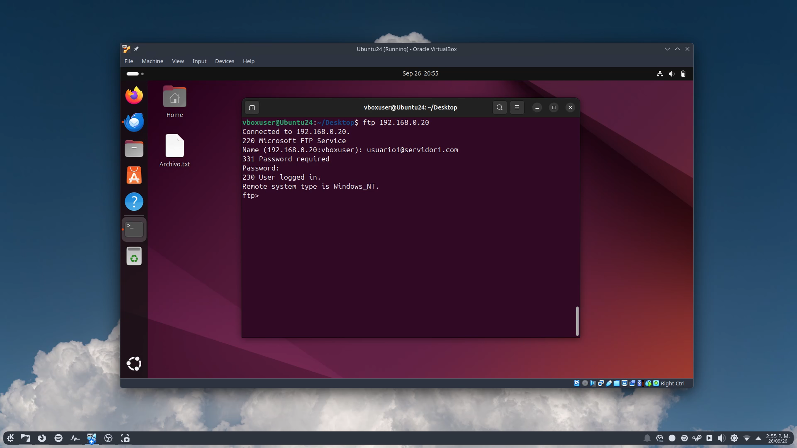

- `ls` muestra el contenido del servidor.

**Figura 79 — Listado del contenido remoto con `ls`.**

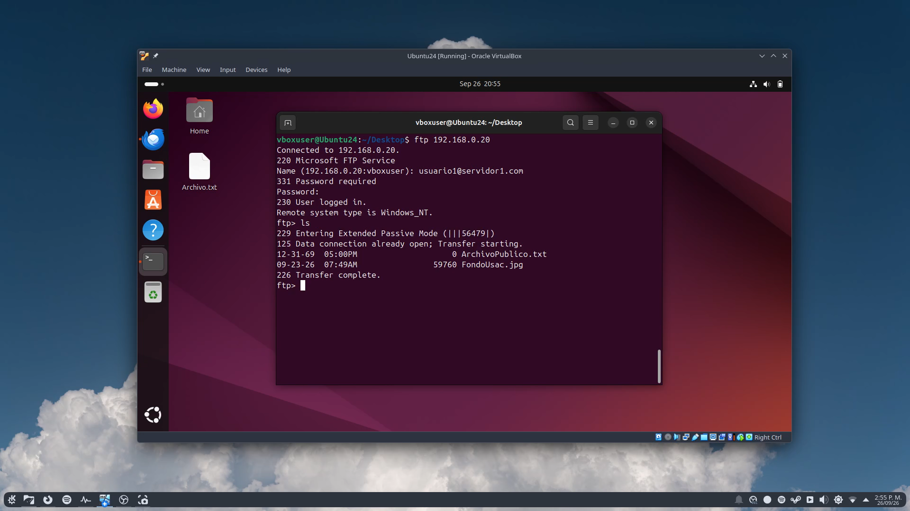

- `put Archivo.txt` prueba la **escritura** (subida). El archivo se encontraba en el escritorio del cliente Linux, desde donde se ejecutó la conexión; un `ls` posterior confirma que ya existe en el servidor.

**Figura 80 — Subida verificada con `put Archivo.txt`.**

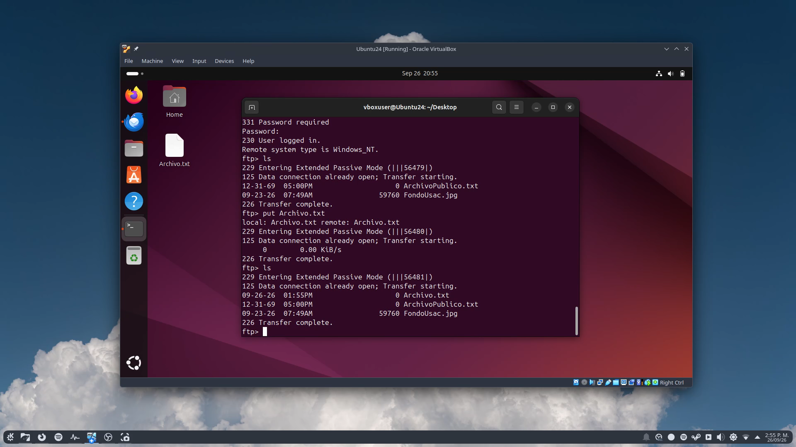

- `get ArchivoPublico.txt` prueba la **lectura** (descarga). El archivo aparece en el escritorio del cliente, confirmando la transferencia completada.

**Figura 81 — Descarga verificada con `get`.**

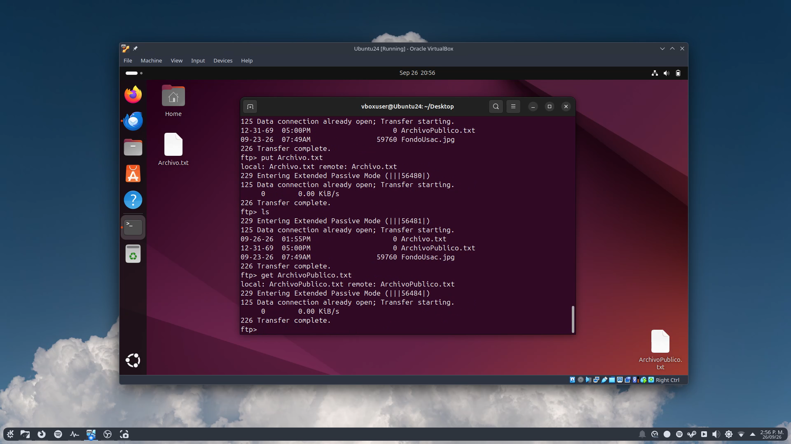

Desde el Explorador de Windows o FileZilla también puede accederse a `ftp://192.168.0.20` con `usuario1` / `Password1`, creando o subiendo un archivo de prueba para demostrar lectura y escritura.

**Referencias:**
- [FTP in IIS — Microsoft Learn](https://learn.microsoft.com/en-us/iis/publish/using-the-ftp-service/creating-a-new-ftp-site-in-iis-7)
- [FTP Authentication — Microsoft Learn](https://learn.microsoft.com/en-us/iis/configuration/system.ftpserver/security/authentication/)

---

## Conclusiones de Fase 1 y Fase 2

1. La virtualización con VirtualBox y red en puente proporciona una base estable para simular una red empresarial con un único host físico.
2. AD DS + DNS constituyen la columna vertebral: sin resolución de `servidor1.com` ningún otro servicio (unión al dominio, DHCP con actualización DNS, SMB) opera de forma fiable.
3. La validación `runas` + inicio de sesión en cliente + `whoami = servidor1\usuario1` demuestra autenticación de extremo a extremo.
4. DHCP con ámbito `Ambito_Red_Local`, exclusiones y reservas por MAC garantiza direccionamiento ordenado y predecible (`.20` servidor, `.50` Linux, `.51` Windows).
5. El File Server con doble capa Share + NTFS cumple el principio de mínimo privilegio: recurso público abierto y recurso privado denegado correctamente a usuarios no autorizados.
6. Las GPO de fondo y navegador centralizan la imagen institucional; la limitación en Linux (sin GPO nativa, políticas JSON para Chrome, sin fondo).
7. El correo con hMailServer + AD + Thunderbird demuestra comunicación real entre buzones del dominio (SMTP/IMAP) con una sola identidad por usuario.
8. IIS publica contenido diferenciado por sitio: área pública inmediata, área privada con autenticación en puerto no estándar (1080) y alias `/correo` por redirección HTTP nativa.
9. FTP de IIS reutiliza las cuentas de dominio y la Carpeta Pública, verificando lectura (`get`/`ls`) y escritura (`put`) desde Linux y Windows.

El entorno integra la base de Fase 1 (usuarios, DNS y DHCP) con los servicios de comunicación y publicación de Fase 2, quedando operativo de extremo a extremo.

---

## Anexo A — Tabla resumen de direccionamiento y cuentas

| Host | IP / Máscara | Gateway | DNS | Observación |
|---|---|---|---|---|
| WS22 (DC, DNS, DHCP, Files) | 192.168.0.20 /24 | 192.168.0.1 | 127.0.0.1 (sí mismo) | Excluida del DHCP |
| Router/Gateway | 192.168.0.1 | — | — | Excluida del DHCP |
| Ubuntu24 | 192.168.0.50 (reserva) | 192.168.0.1 | 192.168.0.20 | MAC registrada en DHCP |
| W10 | 192.168.0.51 (reserva) | 192.168.0.1 | 192.168.0.20 | MAC registrada en DHCP |
| Pool dinámico restante | 192.168.0.2–.100 (menos excluidas/reservadas) | — | — | Lease 8 días |

| Cuenta AD | UPN | Uso en Fase 1 y Fase 2 |
|---|---|---|
| usuario1 | usuario1@servidor1.com | Acceso a Publica + Privada, validación whoami, FTP (lectura/escritura) |
| usuario2 | usuario2@servidor1.com | Acceso solo a Publica (denegado en Privada para demostrar ACL), FTP (lectura/escritura) |
| correo1 | correo1@servidor1.com | Buzón hMailServer con autenticación AD, Thunderbird IMAP/SMTP |
| correo2 | correo2@servidor1.com | Buzón hMailServer con autenticación AD, Thunderbird IMAP/SMTP |
| Administrador | Administrador@servidor1.com | Unión de equipos al dominio, gestión GPO/DHCP |

| Servicio Fase 2 | URL / Punto de acceso |
|---|---|
| Correo IMAP/SMTP | `mail.servidor1.com` (IMAP 143, SMTP 25, POP3 110) |
| Web pública | `http://192.168.0.20/publicweb` |
| Web privada | `http://192.168.0.20:1080/privadaweb` |
| Redirección correo | `http://192.168.0.20/correo` → webmail (HTTP Redirect) |
| FTP público | `ftp://192.168.0.20` (puerto 21, sitio `FTP_Publico`) |

---

## Anexo B — Comandos de referencia rápida

```powershell
# --- Windows Server (PowerShell admin) ---
Install-WindowsFeature -Name AD-Domain-Services, DNS, DHCP -IncludeManagementTools
Install-ADDSForest -DomainName "servidor1.com" -InstallDns:$true
Add-Computer -DomainName "servidor1.com" -Credential (Get-Credential) -Restart
Get-LocalUser
gpupdate /force
whoami
runas /user:usuario1@servidor1.com cmd.exe
ipconfig /all
ipconfig /release; ipconfig /renew
# Firewall Fase 2: correo + IIS + FTP
New-NetFirewallRule -DisplayName "hMailServer Ports" -Direction Inbound -Protocol TCP -LocalPort 25,110,143 -Action Allow
New-NetFirewallRule -DisplayName "IIS Puerto 1080" -Direction Inbound -Protocol TCP -LocalPort 1080 -Action Allow
```

```bash
# --- Ubuntu 24.04 ---
sudo apt update && sudo apt install -y realmd sssd sssd-tools adcli krb5-user cifs-utils
realm discover servidor1.com
sudo realm join -U 'Administrador' servidor1.com
sudo pam-auth-update --enable mkhomedir
sudo systemctl restart sssd
ip link show; ip a
sudo dhclient -r && sudo dhclient
ping servidor1.com
gio mount smb://usuario1@servidor1.com/Privada
cat /etc/opt/chrome/policies/managed/institucional.json
# Thunderbird + FTP (Fase 2)
sudo apt install -y thunderbird
ftp 192.168.0.20
# dentro de ftp: ls | put Archivo.txt | get ArchivoPublico.txt | bye
```

---

## Anexo C — Referencias y documentación oficial

- VirtualBox Networking — Bridged: https://www.virtualbox.org/manual/ch06.html#network_bridged
- AD DS Overview: https://learn.microsoft.com/en-us/windows-server/identity/ad-ds/get-started/virtual-dc/active-directory-domain-services-overview
- DNS Overview: https://learn.microsoft.com/en-us/windows-server/networking/dns/dns-top
- DHCP Overview: https://learn.microsoft.com/en-us/windows-server/networking/technologies/dhcp/dhcp-top
- Group Policy Overview: https://learn.microsoft.com/en-us/windows-server/identity/ad-ds/plan/group-policy/group-policy-overview
- Microsoft Edge — Download / Configure policies: https://www.microsoft.com/en-us/edge/business/download — https://learn.microsoft.com/en-us/deployedge/configure-microsoft-edge
- Chrome Enterprise Policy List: https://chromeenterprise.google/policies/
- Ubuntu — SSSD + Active Directory: https://ubuntu.com/server/docs/service-sssd-ad
- SMB / File Server: https://learn.microsoft.com/en-us/windows-server/storage/file-server/file-server-smb-overview
- NTFS / Share permissions: https://learn.microsoft.com/en-us/windows-server/storage/file-server/ntfs-overview
- hMailServer documentation: https://www.hmailserver.com/documentation
- IIS Web Server overview: https://learn.microsoft.com/en-us/iis/get-started/introduction-to-iis/iis-web-server-overview
- IIS HTTP Redirect: https://learn.microsoft.com/en-us/iis/configuration/system.webserver/httpredirect/
- IIS FTP – Create a new FTP site: https://learn.microsoft.com/en-us/iis/publish/using-the-ftp-service/creating-a-new-ftp-site-in-iis-7
- Thunderbird (Mozilla Support): https://support.mozilla.org/en-US/products/thunderbird
